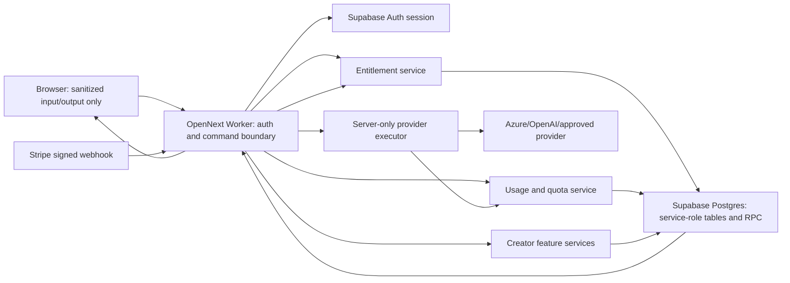

# Comment Translator Creator No-Container Architecture

```text
verified_at=2026-08-06
feasibility_decision=conditional-go
launch_readiness_decision=no-go
conditional-go=forbidden-while-release-hard-requirement-unresolved
selected_runtime=cloudflare-workers-open-next
selected_persistence=supabase-postgres-existing-server-only-boundary
container_disposition=rejected-not-a-candidate
implementation_status=implemented-through-nc-r1-local-readiness
deploy_status=not-approved
worker_bundle_internal_acceptance_ceiling_bytes=3000000
worker_bundle_internal_ceiling_scope=local-acceptance-only
```

## Decision

Comment Translator Creator は、Cloudflare Containers、Docker image、managed Container Registry、Container binding、Container-backed Durable Object、paid Container permissionを一切使わず再設計できる。ただしこれは selected local architecture であり、NC-R1 の paid launch readiness は **NO-GO** のままである。「継続的なplatform infrastructure costを無料枠内に抑えられる」は未測定の条件であり、製品全体が完全無料という意味ではない。

推奨は、現行の単一Cloudflare Worker / OpenNext境界を維持し、認証・RLS・service-role-only永続化・atomic RPCを既存Supabase projectへ集約する案である。Cloudflare上に新しい永続化製品を追加しない。翻訳providerとStripeは従量費用の別境界として扱う。

次の条件をすべて満たす間だけ、platform infrastructureを無料枠内に保てる可能性がある。

1. Cloudflare accountがWorkers Freeで、account全体のWorker requestが100,000/day以内、各HTTP invocationが原則10ms CPU以内、bundleがこの authority の internal acceptance ceiling である **3,000,000 gzip-compressed bytes** 以内に収まる。この ceiling は official public wording `3 MB after compression` に安全側で留まるために選んだ internal acceptance boundary であり、provider の binary/decimal semantics、bundle measurement、account headroom、deployed proof を主張しない。
2. Supabase Freeの2 active projects制約内で既存projectを継続利用し、database size 500MB/project、egress 5GB/month、Storage 1GB、50,000 MAU等の該当quota内に収まる。
3. Supabase Freeの低活動pause、downloadable backup不在、SLA不在をCreatorの運用リスクとして受容するか、公開paid launch前に人間が有料化を選択する。
4. provider利用量とStripe取引手数料をplatform free-tierと混同せず、server-owned hard stopを先に適用する。

特にWorkers Freeの10ms CPUは厳しい。Cloudflare公式はSSRや認証など重い処理が通常10-20msになり得ると説明している。したがって現時点では「無条件にFreeでproduction実行可能」「deploy-ready」「production-ready」とは判定しない。最初の実装laneで実Worker相当のCPU/size characterizationを行い、超過する場合は機能を削る、static化する、処理をSupabase RPC/provider I/Oへ寄せる、または人間判断でpaid platformへ移る。Containerをfallbackにはしない。

## Repository And Handoff Evidence

| Evidence | Verified result |
| --- | --- |
| PR #724 | `MERGED`, merge commit `f2300ec083f283fed714d7ef4962b4e61cc82e05` |
| integration | `origin/codex/comment-translator-free-public-beta-integration` = `f2300ec083f283fed714d7ef4962b4e61cc82e05` |
| main | `origin/main` = `2c92a37bb3ba4c472c3470b8db77594a4b0fca65` |
| integration/main tree | both `30e9a45e0761f003c4884e3d798e3ef7fcd9f74b` |
| read-only archive | `origin/codex/archive-comment-translator-free-public-beta-integration-20260801` = `51bbba0ca9f087d590219a15a7c1516d6ec17e86` |
| archive tree | `a2ee756bb9be8a4c7886f1ac6e3427d6334e5de4` |
| current worktree | fresh isolated branch `codex/comment-translator-creator-no-container-architecture` from the integration tip |

Archiveはlegacy要件を読むためだけの資料である。archiveのruntime code、migration、contract、Dockerfile、Container設定、binding、proof、authorityはcherry-pick・復元・新設計の根拠にしない。

## Current Free Architecture Inventory

| Boundary | Current repository evidence | Creator may depend on | Creator must not weaken |
| --- | --- | --- | --- |
| Cloudflare runtime | `wrangler.jsonc` points to `.open-next/worker.js`, enables `nodejs_compat`, static assets, observability; no Container/D1/DO/KV/R2/Queue binding exists. The legacy migration ledger retains the historical C1 create tag plus an explicit delete tag until the remote namespace is retired. | one HTTP Worker, static assets, outbound `fetch` | Free route behavior, bundle/runtime compatibility, fail-closed route handling |
| Next/OpenNext | Next 16.2.6, `@opennextjs/cloudflare` 1.19.11, default `defineCloudflareConfig()` | App Router, Route Handlers, Server Actions, SSR/SSG supported by the adapter | do not introduce a second backend or browser authority |
| Supabase | `@supabase/ssr` for browser/server auth; `@supabase/supabase-js` service-role adapters for trusted stores | existing project, server-owned RLS/service-role tables and atomic RPCs | no service-role key or private reference in browser; missing config fails closed |
| auth/session | server derives caller from Supabase session; translator session route/actions are server-owned | authenticated owner binding, current session authority | browser input cannot select owner, entitlement, session, provider target, or liveChatId |
| session limits | durable session store and server entitlement policy | 30 min/day, 30 min/session, 1 active session/user | unreadable durable state stops safely |
| quota/rate guard | durable usage ledger/counter plus abuse guard; app-side enforcement is authority | atomic dedupe, monthly provider-input accounting, sanitized stop reasons | cache hits do not become provider execution; accounting failure suppresses success |
| provider execution | server-only Azure/OpenAI policy runtime; DeepL server-only prototype; raw text logging disabled by default | outbound provider fetch, bounded fallback, strict output parsing | credentials stay server-only; no Free-to-paid-LLM fallback; no raw private payload persistence |
| browser-safe output | safe feed, sanitized session/usage/billing labels, forbidden private fields | existing projections and source attribution | no tokens, owner ids, billing ids, provider metadata, liveChatId, raw provider bodies |
| Stripe | server-only Checkout/Portal/webhook seams and signed webhook entitlement model exist, but public paid activation is not current Free behavior | signed evidence, idempotency, Free/paid-inactive fallback | no browser-selected Price/Customer/Subscription; no unsigned billing authority |

## Cost Boundary

「無料」はplatform infrastructureのfree-tier利用を指す。翻訳/AI provider利用、Stripe決済、メール・監視等の外部サービスは別会計である。

| Cost class | Public-source observation refreshed 2026-08-06 | Trigger | Required response |
| --- | --- | --- | --- |
| Cloudflare platform/runtime cost | Workers Free: 100,000 requests/day, 10ms CPU/invocation, 128MB memory, 50 subrequests/invocation, official wording `3 MB after compression`; local acceptance ceiling is 3,000,000 gzip-compressed bytes only | request/CPU/bundle/subrequest limitへ接近、またはPaid機能が必要 | 80%で新Creator sessionを抑制、90%で新規/継続Creator処理をfail-closed。最適化か明示的paid承認。Free超過は自動課金ではなくエラーとして扱う |
| Supabase/database cost | Free: 2 active projects、500MB database/project、5GB egress、1GB Storage、50,000 MAU、shared Nano compute | database/egress/storage/MAU接近、read-only、pause warning、性能不足 | 80%でretention/export/新規Creator開始を抑制、90%でwrite-heavy Creator機能を閉じる。archive/削除/upgradeは別承認 |
| translation/AI provider cost | Azure F0は2M characters/month、DeepL API Freeは500,000 characters/month。OpenAIはtoken従量で、repoはmodelをserver envで選ぶ | provider quota、account budget、model価格、paid fallback | provider call前のserver-owned soft/hard stop。Freeはpaid LLMへ自動fallbackしない。OpenAI/paid providerは売上原価として別予算 |
| Stripe/payment processing cost | Japan standard domestic card successful charge 3.6%; BillingはBilling取引額の0.7%という別料金。Checkout自体はPayments利用時追加なし | successful payment、Billing利用、FX、refund/dispute、追加product | 原価として価格設計へ反映。platform無料枠に算入しない。費用/税/契約確認後だけlive activation |
| other external service cost | YouTube APIは金銭free-tierとは別にquota、custom SMTP/monitoring/support等は各service条件 | quota、送信量、保持量、SLA要件 | account-level limitをserver-owned stopへ投影し、追加契約/有料化は別承認 |

Cloudflare product候補のfree-tierは次の通りだが、推奨案では新規採用しない。

| Product | Free boundary | Architecture disposition |
| --- | --- | --- |
| Durable Objects | SQLite-backedのみFree。100,000 requests/day、13,000 GB-s/day、5M rows read/day、100k rows written/day、5GB total storage。超過操作はerror | option Bのみ。Container-backed DOは禁止。既存Supabaseとauthorityが分裂するため非推奨 |
| Queues | 10,000 operations/day、24h retention、通常1 message deliveryでwrite/read/deleteの3 operations | durable billing/quota authorityには不適。非推奨 |
| Workflows | FreeはWorkers request/10ms CPU制約、1GB storage、3,000 steps/day | release/cleanup orchestration候補にはできるが初期Creatorには不要。非推奨 |
| KV | 100k reads/day、1k writes/deletes/lists/day、1GB。超過操作はerror | eventual/global cache用途のみ。entitlement/quota authorityには不適 |
| D1 | 5M rows read/day、100k rows written/day、5GB/account、500MB/database、10 DB/account | option C。Supabase authとのdual-store整合性が重く非推奨 |
| R2 Standard | 10GB-month、1M Class A、10M Class B/month、egress free | 将来CSV/export artifactのみ候補。raw private feed/history保存には使わない |

## No-Container Options

| Axis | A: Worker + existing Supabase | B: Worker + SQLite DO + Supabase auth | C: Worker + D1 + Supabase auth |
| --- | --- | --- | --- |
| runtime compatibility | current exact topology | OpenNext binding追加が必要 | OpenNext D1 binding追加が必要 |
| repository fit | highest; current trusted stores/RPCsを再利用 | medium; new state adapter/DO class/migration | medium-low; Postgres→SQLite semantics再設計 |
| trust boundary | one server-owned persistence authority | two durable authorities | two durable authorities |
| credentials | Worker secret→Supabase/provider only | same plus DO RPC capability | same plus D1 binding |
| auth/authz | existing Supabase session | Supabase auth then DO key derivation | Supabase auth then D1 owner filters |
| persistence | Supabase Postgres/RLS/RPC | coordination in DO、domain data in Supabase | Creator data in D1、auth/token data in Supabase |
| quota/concurrency | Postgres transaction/RPC locks | per-object serialization is strong | SQLite transaction, DB is single-threaded |
| free-tier trigger | Supabase 500MB/5GB egress; Worker 100k/day/10ms | plus DO request/duration/row limits | plus D1 row/storage limits |
| observability | existing sanitized app labels + platform metrics | two platform metric sets | two DB metric sets |
| complexity | lowest | high | highest migration/consistency cost |
| failure modes | Supabase unavailable/read-only/pause => fail closed | DO or Supabase split failure | D1 or Supabase split failure |
| rollback | remove Creator seams; Free unchanged | binding/class migration rollback required | binding/schema/data migration rollback required |
| privacy/security | least new surface | capability/identity mapping duplication | data residency and owner mapping duplication |
| implementation difficulty | lowest | medium-high | high |
| decision | recommended, conditional | rejected for initial roadmap | rejected for initial roadmap |

### Why Queues, Workflows, KV, And R2 Are Not Primary Options

- Entitlement、quota、token revoke、dictionary update、history deleteはread-after-writeとatomic authorizationが必要であり、Queue/KVをauthorityにするとfail-closed判断が複雑になる。
- Workflowsは長期手順には有用だが、通常のchat translation request pathへ追加する価値がない。
- R2はobject storageであり、owner-scoped transactional stateの主authorityではない。
- 新しいCloudflare bindingは無料でも運用・migration・rollback surfaceを増やす。既存Supabaseで要件を満たせる間はYAGNIである。

## Recommended Architecture

### Component Boundaries

1. **Browser/UI**: sanitized plan/session/feed/history/token metadataだけを表示する。credential、owner id、billing/provider referenceは保持しない。
2. **Next server actions / route handlers on OpenNext Worker**: caller sessionを解決し、固定authorization boundaryを通し、requestを小さなserver-owned commandへ変換する。
3. **Creator entitlement service**: signed Stripe evidenceからのみpaid-activeを読み、missing/unreadable/inactiveはFreeまたはpaid-inactiveへ落とす。
4. **Usage service**: provider-executed eventだけをidempotentに記録し、session/daily/monthly/provider budgetをatomic RPCで判定する。
5. **Creator feature stores**: token digest、dictionary、safe historyなどをservice-role-only table/RPCで所有する。raw private provider payloadは保存しない。
6. **Provider executor**: server envだけからprovider/modelを選び、strict output parsing、bounded timeout、approved fallbackを適用する。
7. **Stripe adapter/webhook**: Checkout/Portalはauthenticated+allowlisted+activation gate。webhook signature検証後のみentitlement evidenceを書く。
8. **Supabase**: auth session、RLS、service-role-only tables、atomic RPC、owner-scoped cleanupの唯一のpersistent authority。

## Request And Data Flow



1. Browserはexisting Supabase cookie sessionを送る。owner idやplanを指定しない。
2. Workerがcallerをserver-sideで解決し、Creator actionごとのauthorizationを固定する。
3. entitlementとquotaをSupabaseのserver-only read/RPCで確認する。いずれかがunavailableならprovider/Stripe/feature mutation前に停止する。
4. provider executionはquota reservation後に行い、cache hitはprovider usageへ課金しない。
5. provider成功はdedupe key付きusage eventとしてcommitできた場合だけbrowser-safe translated resultへ昇格する。
6. browserへ返すのはsafe projection、status/reason/count、必要なone-time opaque capabilityだけである。

## Trust Boundary

| Data/capability | Browser | Worker memory | Supabase | External provider |
| --- | --- | --- | --- | --- |
| auth cookie | HttpOnly transport | verify | auth authority | never |
| service-role/provider/Stripe secret | never | server env only | service role used, not stored as row | request auth only |
| owner/private billing reference | never | derived/transient | service-role-only | Stripe minimum metadata only |
| raw comment | input/render only as existing safe policy permits | transient | never persist as raw private payload; history uses safe projection only | translation input only |
| token plaintext | one-time issue/redeem only | hash then discard | digest only | never |
| usage event | never as authority | derive opaque dedupe | durable aggregate/event | provider units only |

## Auth, Entitlement, And Usage Rules

- Creator access = authenticated caller + exact activation policy + readable signed entitlement + feature-specific capability。browser plan flags are ignored.
- Stripe webhook is the only billing-state write authority. Checkout success redirect alone never activates Paid.
- C1/C3 legacy process-isolation requirement is removed because it protected a former implementation detail, not a user requirement. Server-only secret handling is preserved through Worker env + service-role adapter; immutable runtime copies are treated as ordinary server-runtime residual risk, not solved with a Container.
- usage accounting reserves/records only provider-executed work. Cache hit、moderation skip、same-language skip、failed parse、failed accountingはpaid usage成功にならない。
- quota exhaustion returns a sanitized stop reason, does not downgrade into unmetered provider execution, and does not silently charge another provider.

## Failure And Rollback

| Failure | Behavior | Rollback/operation |
| --- | --- | --- |
| Supabase missing/unreadable/paused/read-only | no Creator mutation/provider/billing read success; Free remains available where its own durable boundary is healthy | restore project or approve upgrade; no inferred entitlement |
| Worker CPU/request limit | Cloudflare error; no browser/client fallback authority | reduce SSR/CPU, shed Creator work, or approve Workers Paid; never add Container fallback |
| provider timeout/429/5xx | bounded retry; Paid may use approved Azure fallback, Free never paid-LLM fallback | stop/skip with sanitized class; operator budget review |
| provider policy/parse failure | no fallback, no usage success | retain original/sanitized failure, investigate contract |
| Stripe failure/webhook gap | paid-inactive/Free; no entitlement activation | reconcile signed event under separate approval |
| quota/storage near cap | stop new Creator sessions/features before hard limit | retention/cleanup or paid upgrade under explicit approval |
| deployment regression | revert Creator feature commits/config while preserving existing Free paths and data | repository deployment owner executes approved rollback |

Migration is additive and lane-by-lane: characterization → schema → disconnected adapters → server authorization → feature wiring → live evidence. No lane may make browser state authoritative or require a bulk cutover. Each new schema must be service-role-only, RLS/grant reviewed, additive, and reversible by leaving the feature gate closed; destructive rollback is a separate approval.

The `CommentTranslatorC1Container` delete migration is not a new Creator runtime or persistence option. It is one-time lifecycle cleanup for a namespace created by the rejected legacy Container design. The Worker must continue to omit the Container, class export, and Durable Object binding. Applying the migration permanently deletes the legacy namespace and all stored data, so merge/deploy remains an explicit destructive-operation approval boundary.

## Logging And Observability Boundary

- Allow: route/action label、status/reason、latency bucket、CPU/request/egress/storage quota percentage、provider class、count、opaque correlation reference。
- Forbid: raw comment/provider payload、token/secret/cookie、owner/account/billing/provider identifiers、target metadata、liveChatId、private URL、authorization header。
- Application hard-stop metrics must be observable before provider/Stripe invocation.
- Cloudflare/Supabase/provider/Stripe account dashboards remain operator-owned. This design authorizes no remote account observation or mutation.

## Security And Privacy Invariants

1. fail-closed on missing, unreadable, incomplete, inactive, over-limit, malformed, stale, replayed, or unauthorized state;
2. server-only credentials and service-role ownership;
3. browser-safe output only;
4. no raw private payload persistence;
5. no unauthorized billing/account reads;
6. fixed server-derived authorization boundary;
7. digest-only reusable capabilities and one-time plaintext delivery;
8. owner-scoped, idempotent deletion/disconnect cleanup;
9. existing Free behavior, quota, privacy, auth, provider and release boundaries remain unchanged;
10. no Container, Docker, Registry, Container binding, Container-backed DO, or paid Container permission now or as fallback.

## Feasibility Gates And Human Decisions

Before implementation may be called release-ready, a human must decide or approve:

- whether Workers Free 10ms CPU and the local 3,000,000 gzip-compressed-byte acceptance ceiling are acceptable after measured characterization;
- whether Supabase Free pause/no-downloadable-backup/no-SLA posture is acceptable for a paid product;
- retention volumes that keep database and egress within thresholds;
- exact paid entitlements and provider monthly budget/soft/hard stop values;
- exact OpenAI model or other paid provider and account-level spend caps;
- Stripe product/price/tax/refund/support copy and live-mode activation;
- any Cloudflare/Supabase configuration, migration apply, deploy, remote read, provider call, browser smoke, gate flip, or release operation.

## Official Sources

The Worker, Supabase, Azure, DeepL, OpenAI, and Stripe observations used by NC-R1 were refreshed as public official sources on 2026-08-06 in `docs/active/COMMENT_TRANSLATOR_CREATOR_NC_R1_PAID_LAUNCH_READINESS.md`. Supabase's production checklist still states that database backups are not available for download for Free Plan projects. These remain public-source observations only and do not prove account headroom, target configuration, actual backup/recovery state, approval, live behavior, or deployment. The remaining architecture reference URLs below must be rechecked for their own later operation; they are not silently refreshed by this document.

- Cloudflare Workers pricing: https://developers.cloudflare.com/workers/platform/pricing/
- Cloudflare Workers limits: https://developers.cloudflare.com/workers/platform/limits/
- Cloudflare Durable Objects pricing: https://developers.cloudflare.com/durable-objects/platform/pricing/
- Cloudflare Durable Objects limits: https://developers.cloudflare.com/durable-objects/platform/limits/
- Cloudflare Durable Object legacy class migrations: https://developers.cloudflare.com/durable-objects/reference/durable-object-class-migrations-legacy/
- Cloudflare Queues pricing: https://developers.cloudflare.com/queues/platform/pricing/
- Cloudflare KV pricing: https://developers.cloudflare.com/kv/platform/pricing/
- Cloudflare D1 pricing: https://developers.cloudflare.com/d1/platform/pricing/
- Cloudflare D1 limits: https://developers.cloudflare.com/d1/platform/limits/
- Cloudflare R2 pricing: https://developers.cloudflare.com/r2/pricing/
- Cloudflare Workflows pricing: https://developers.cloudflare.com/workflows/reference/pricing/
- Cloudflare Next.js/OpenNext guide: https://developers.cloudflare.com/workers/framework-guides/web-apps/nextjs/
- OpenNext Cloudflare adapter: https://opennext.js.org/cloudflare
- Supabase billing and quotas: https://supabase.com/docs/guides/platform/billing-on-supabase
- Supabase database size/read-only behavior: https://supabase.com/docs/guides/platform/database-size
- Supabase Free project pausing: https://supabase.com/docs/guides/platform/free-project-pausing
- Supabase production checklist: https://supabase.com/docs/guides/deployment/going-into-prod
- Azure Translator pricing: https://azure.microsoft.com/en-us/pricing/details/translator/
- Azure Translator service limits: https://learn.microsoft.com/en-us/azure/ai-services/translator/service-limits
- OpenAI current models/pricing catalog: https://developers.openai.com/api/docs/models
- DeepL API usage limits: https://developers.deepl.com/docs/resources/usage-limits
- Stripe Japan pricing: https://stripe.com/jp/pricing

## Non-Claims

This authority does not claim Creator implementation complete、deploy-ready、production-ready、canonical live proof complete、all external costs free、PR #748 deployment success、or any new external-operation approval. PR #748 merge is a repository fact, not deployment proof. It authorizes documentation review only.

## Verification Evidence

- focused contracts: no-container architecture、NC-B1 billing、public entitlement、security/privacy、NC-R1、NC-Q1 are pass。
- local toolchain: lint、strict TypeScript、Next build、OpenNext build are pass after the approved bounded Stripe type repair。
- local Worker measurement: Wrangler dry-run reports `Total Upload: 9477.87 KiB / gzip: 2032.88 KiB`; the conservative rounded upper bound `2,081,675 bytes` is below the internal `3,000,000-byte` ceiling。This remains local evidence, not account headroom、live/deployed proof、or production proof。
- UI/browser QA: UI/CSS変更なしのためwidth-based QAはN/Aであり、passとは扱わない。
- approved lockfile install: 691 packages。`package.json` / `package-lock.json` are unchanged。
- remote product/database/account observation、provider/Stripe live operation、deploy、activation、commit、push are 0。
