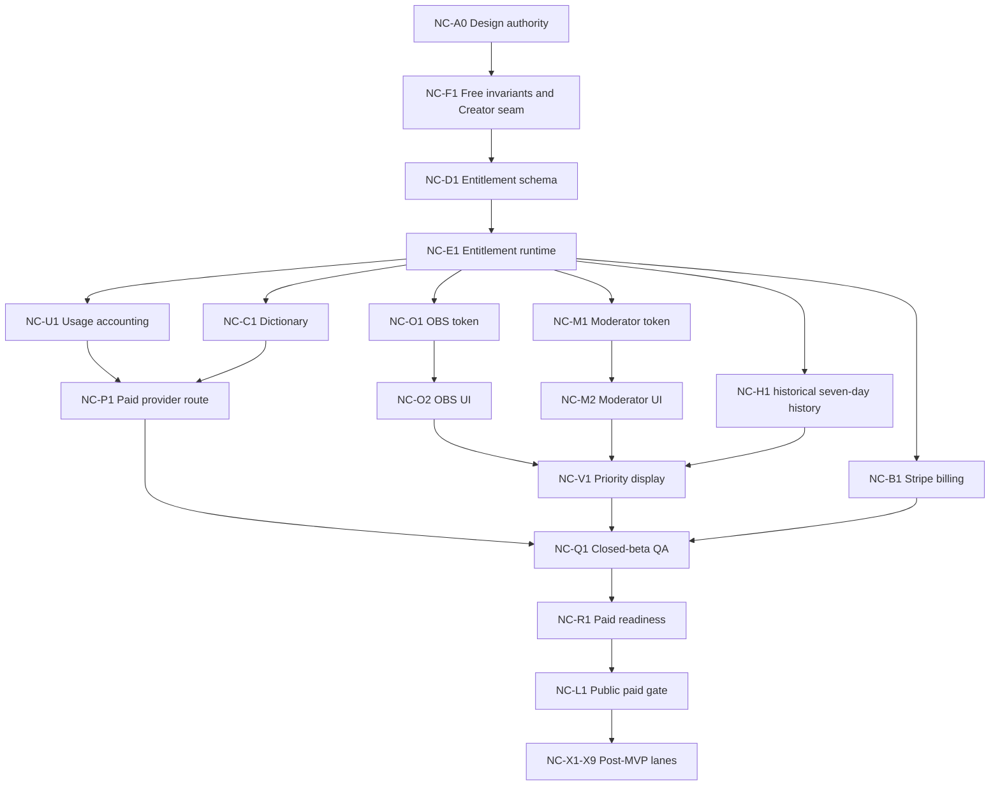

# Comment Translator Creator No-Container Implementation Task Board

```text
verified_at=2026-08-11
repository_state_reconciled_at=2026-08-11
architecture_authority=docs/active/COMMENT_TRANSLATOR_CREATOR_NO_CONTAINER_ARCHITECTURE.md
crosswalk_authority=docs/active/COMMENT_TRANSLATOR_CREATOR_NO_CONTAINER_LEGACY_CROSSWALK.md
first_implementation_pr=NC-F1-completed-pr726
implementation_status=repository-implemented-not-applied
current_lane=NC-X2B-R1
repository_retention_policy=inclusive-thirty-days-server-clock
effective_deployed_retention=inclusive-seven-days-server-clock-unconfirmed
paid_launch_readiness_status=paused-no-go
next_implementation_status=owner-approval-required-before-migration-apply-or-any-external-action
candidate_lanes=NC-X1,NC-X6,NC-X7,NC-X2B-R1-migration-apply
deploy_status=not-run
migration_apply_status=not-run
production_activation=closed
account_headroom=unconfirmed
provider_stripe_cloudflare_supabase_state=unconfirmed
```

## Operating Rules

- dependency orderが番号順。`1 reviewable goal = 1 PR`。
- 各PRはexact fetched integration tipからfresh isolated worktreeを作る。
- schema/config/runtime/browser/live operationを同じapproval unitへ混ぜない。
- Free behavior、auth/privacy/quota/fail-closedをcharacterizationで固定してからCreator seamを追加する。
- dependency install、manifest/lockfile change、remote query/mutation、migration apply、binding/env/secret change、deploy、provider/Stripe/live/browser operation、mergeはそれぞれ明示承認が必要。
- Container、Docker、Registry、Container binding、Container-backed DO、paid Container permissionは全taskでout of scope。

## Merged Implementation Ledger

This ledger records repository merge state only. It does not prove deployment、production activation、live provider / Stripe behavior、migration apply、or external account state.

| Lane | PR | Repository state |
| --- | --- | --- |
| NC-A0 | PR #725 | merged |
| NC-F1 | PR #726 | merged |
| NC-D1 | PR #727 | merged |
| NC-E1 | PR #728 | merged |
| NC-U1 | PR #729 | merged |
| NC-C1 | PR #730-#732 | merged |
| NC-P1 | PR #734 | merged |
| NC-O1 | PR #735-#737 | merged |
| NC-O2 | PR #739-#740 | merged |
| NC-M1 | PR #741 | merged |
| NC-M2 | PR #742 | merged |
| NC-H1 | PR #743 | merged |
| cross-lane build repair | PR #744 | merged |
| NC-V1 | PR #745 | merged |
| NC-B1 | PR #746 | merged |
| NC-Q1 | PR #747 | merged |
| NC-R1 | 0/8 staged rows; 9 unresolved hard requirements | no-go; activation=closed; Free=permanent |
| NC-X4 | PR #753 | merged |
| NC-X3 | PR #754 | merged |
| NC-X5 | PR #755 | merged |
| NC-X2A | PR #756 | merged |
| NC-X2B-P0 | PR #757 | merged |
| NC-X2B-R1 | repository-only implementation | repository-implemented-not-applied; migration not-run; deploy/activation closed |
| NC-L1 | N/A | not-started; blocked by NC-R1 no-go |
| NC-X2B | PR #757 + NC-X2B-R1 repository scope | capacity decision retained; repository-implemented-not-applied |

## Dependency Map



## NC-A0: No-Container Architecture Authority

- **Goal:** 公式free-tier、現repo、legacy 23項目を根拠に設計/crosswalk/task mapを確定する。
- **Scope:** docs/active 3文書、focused contract、task.md最小更新。
- **Out of scope:** runtime/schema/config/deploy/live operation。
- **Expected files/interfaces:** 本authority群、`scripts/comment-translator-creator-no-container-architecture-contract.mjs`。
- **Dependencies:** PR #724 mergeとarchive read-only access。
- **RED/GREEN or characterization:** docs不存在でRED、全required marker/ID/task fieldでGREEN。
- **Targeted verification:** focused architecture contract、legacy completeness、no-Container invariant。
- **Broad verification:** relevant Free contracts、syntax、diff/secret/stale reference scans。
- **Manual QA:** docs-onlyのためbrowser不要; rendered Markdown review。
- **Rollback:** docs/contract/task changeをrevert。
- **Approval implications:** commit/push/draft PRのみ本taskで承認済み。
- **External operations:** public official docs read、GitHub PR metadata read、push/draft PR。
- **Completion criteria:** review-ready docs-only draft PR、mergeなし。

## NC-F1: Free Invariant Characterization And Creator Seam

- **Goal:** existing Free挙動を固定し、disabled/fail-closedなserver-only Creator interfaceだけを追加する。
- **Scope:** auth/session/quota/provider/browser-safe characterization、Creator service interfaces、no-op/unavailable adapter。
- **Out of scope:** schema、Stripe/provider live、UI、binding、deploy。
- **Expected files/interfaces:** `lib/comment-translator-creator-boundary.ts`、focused contracts、existing Free contracts。
- **Dependencies:** NC-A0 merge。
- **RED/GREEN or characterization:** existing Free outcomesを先にpass固定; missing Creator authorityがRED; disabled seamがGREEN。
- **Targeted verification:** auth fail-closed、Free limits、no provider call、browser-safe shape。
- **Broad verification:** Comment Translator contract batch、lint/typecheck/build/OpenNext build。
- **Manual QA:** runtime-visible changeなしをroute inspectionで確認; browser幅QA不要。
- **Rollback:** new disconnected filesだけrevert。
- **Approval implications:** dependency installが必要なら停止。
- **External operations:** none。
- **Completion criteria:** Free diffゼロ相当、Creator unavailable、no secret/client authority。最小で安全な最初のimplementation PR。

## NC-D1: Paid Entitlement Data Model

- **Goal:** signed Stripe evidenceを保持するservice-role-only entitlement schema/RPCを定義する。
- **Scope:** additive migration、RLS/grants、atomic stale/replay/price/period rules、adapter contract。
- **Out of scope:** remote apply、live read/write、billing activation、Container。
- **Expected files/interfaces:** one Supabase migration、entitlement store adapter、schema contract。
- **Dependencies:** NC-F1。
- **RED/GREEN or characterization:** missing schema predicates RED; local migration text/adapter fixtures GREEN。
- **Targeted verification:** signed-only、stale/replay、service-role-only、missing config fallback。
- **Broad verification:** migration/security contracts、typecheck/build。
- **Manual QA:** server/schema-only; browser不要。
- **Rollback:** feature gate closed、migration未applyならrevert; applied rollbackは別承認。
- **Approval implications:** migration applyは別PR/approval unit。
- **External operations:** none。
- **Completion criteria:** local schema/adapter review-ready、production write/read 0。

## NC-E1: Paid Entitlement Runtime

- **Goal:** authenticated callerからserver-derived billing refを作り、NC-D1を唯一のpaid authorityとして読む。
- **Scope:** authorization、read projection、Free/paid-inactive fallback、fixed activation gate。
- **Out of scope:** Stripe mutation、provider、UI、remote read、deploy。
- **Expected files/interfaces:** entitlement service、action context integration、focused contract。
- **Dependencies:** NC-D1 merged; remote applyは別gate。
- **RED/GREEN or characterization:** in-memory paid map pathを禁止するRED; durable/unavailable fixtures GREEN。
- **Targeted verification:** unauth/missing/unreadable/inactive/expired/mismatch。
- **Broad verification:** Free auth/session/quota/billing contracts、build。
- **Manual QA:** browser-visible paid unlockなし; browser不要。
- **Rollback:** activation closed、runtime seam revert。
- **Approval implications:** production activation/read proofは別承認。
- **External operations:** none。
- **Completion criteria:** no Container、no browser authority、Free unchanged。

## NC-U1: Paid Usage Accounting And Reset

- **Goal:** provider-executed paid usageをperiod-bound atomic/deduplicatedに記録する。
- **Scope:** counter/event schema、RPC、soft/hard stops、cache-hit exclusion、signed period reset。
- **Out of scope:** invented quota値、provider live call、remote apply。
- **Expected files/interfaces:** one migration、usage store/runtime、contracts。
- **Dependencies:** NC-E1。
- **RED/GREEN or characterization:** duplicate/concurrent/cache-hit/stale period RED→GREEN。
- **Targeted verification:** exactly-once、reset、accounting failure suppresses result。
- **Broad verification:** Free usage/session/provider contracts、typecheck/build。
- **Manual QA:** usage UIは未変更; browser不要。
- **Rollback:** paid route disconnected、new writes停止。
- **Approval implications:** quota/price/reset policyとremote applyは別承認。
- **External operations:** none。
- **Completion criteria:** sanitized counts only、no provider call、Free accounting invariant維持。

## NC-P1: Paid Provider Route

- **Goal:** paid-active+budget内だけOpenAI mini primary/Azure approved fallbackを実行可能にする。
- **Scope:** NC-E1/NC-U1/C1 glossary integration、strict parse、timeout/error classes。
- **Out of scope:** live call、model/value決定、browser provider metadata。
- **Expected files/interfaces:** provider policy/execution runtime edits、contracts。
- **Dependencies:** NC-U1、NC-C1。
- **RED/GREEN or characterization:** auth/budget/config/parse/fallback/accounting cases RED→GREEN。
- **Targeted verification:** no Free paid-LLM fallback、approved recoverable fallback only。
- **Broad verification:** provider/session/feed/usage contracts、lint/typecheck/build/OpenNext。
- **Manual QA:** deterministic fake provider scenario; live browser不要。
- **Rollback:** paid provider gate off、Free Azure path維持。
- **Approval implications:** model/provider account/budget/live smokeは別承認。
- **External operations:** none。
- **Completion criteria:** server-only、fail-closed、accounted success only。

## NC-C1: Custom Dictionary Minimum

- **Goal:** owner-scoped 30-term dictionaryとeffective versionを提供する。
- **Scope:** schema/RPC、CRUD runtime、language/normalization、provider/cache hook。
- **Out of scope:** import/suggestions、remote apply、live provider、UI polish。
- **Expected files/interfaces:** one migration、dictionary store/runtime/actions、contracts。
- **Dependencies:** NC-E1; provider hookはNC-P1がconsume。
- **RED/GREEN or characterization:** owner isolation/collision/stale/limit/version RED→GREEN。
- **Targeted verification:** note non-forwarding、cache version separation。
- **Broad verification:** security/provider/cache/build contracts。
- **Manual QA:** minimal authenticated CRUD UIを含む場合390/820/1024/1280/1366。
- **Rollback:** feature gate off、provider ignores glossary。
- **Approval implications:** schema apply/browser/provider smoke別承認。
- **External operations:** none。
- **Completion criteria:** safe CRUD、30-term bound、no raw/private metadata。

## NC-O1: OBS Overlay Token Runtime

- **Goal:** session-scoped OBS read capabilityをdigest-onlyでissue/rotate/revokeする。
- **Scope:** token schema/RPC/runtime、current session recheck。
- **Out of scope:** overlay route/UI、live token、remote apply。
- **Expected files/interfaces:** one migration、OBS token service、contracts。
- **Dependencies:** NC-E1、existing session authority。
- **RED/GREEN or characterization:** replay/rotate/revoke/expiry/unreadable RED→GREEN。
- **Targeted verification:** one-time plaintext、digest-only、32-byte entropy contract。
- **Broad verification:** session/security/secret scans/build。
- **Manual QA:** server-only; browser不要。
- **Rollback:** issue gate off、existing tokens unavailable。
- **Approval implications:** remote apply/live token別承認。
- **External operations:** none。
- **Completion criteria:** no plaintext persistence/logging、fail-closed。

## NC-O2: OBS Overlay Browser Route

- **Goal:** POST redemptionからstable token-free transparent overlayを提供する。
- **Scope:** HttpOnly capability、safe feed、badges/original/source display。
- **Out of scope:** provider/session mutation、browser storage、live token proof。
- **Expected files/interfaces:** route/actions、capability schema/store、overlay components/contracts。
- **Dependencies:** NC-O1。
- **RED/GREEN or characterization:** transport/cookie/replay/safe projection RED→GREEN。
- **Targeted verification:** no token URL/storage/DOM、C5 version recheck。
- **Broad verification:** overlay/session/feed/security/build。
- **Manual QA:** transparent canvas、390/820/1024/1280/1366、console/overflow 0。
- **Rollback:** route unavailable、token runtime retained。
- **Approval implications:** live redemption/authenticated feed/deploy別承認。
- **External operations:** none。
- **Completion criteria:** stable safe overlay、revocation immediate。

## NC-M1: Moderator Share Token Runtime

- **Goal:** C5/C6と分離したsession-scoped moderator read tokenを提供する。
- **Scope:** issue/read/revoke/expiry、digest-only store、cross-token rejection。
- **Out of scope:** moderator identity/email/delivery/UI。
- **Expected files/interfaces:** one migration、token runtime/store、contracts。
- **Dependencies:** NC-E1、session authority。
- **RED/GREEN or characterization:** duplicate/replay/cross-scope/concurrent issue RED→GREEN。
- **Targeted verification:** one current token、post-revoke reissue、safe metadata。
- **Broad verification:** OBS/session/security contracts。
- **Manual QA:** server-only; browser不要。
- **Rollback:** issue gate off。
- **Approval implications:** remote apply/live share/delivery別承認。
- **External operations:** none。
- **Completion criteria:** distinct scope/store、no identity inference。

## NC-M2: Moderator Share Browser Route

- **Goal:** stable read-only moderator viewをtoken-free URLで提供する。
- **Scope:** POST redemption、separate cookie/digest、safe feed/deleted/source。
- **Out of scope:** moderation actions、role assignment、browser feed authority。
- **Expected files/interfaces:** route/actions/store/components/contracts。
- **Dependencies:** NC-M1。
- **RED/GREEN or characterization:** transport/reissue/revoke/session replacement RED→GREEN。
- **Targeted verification:** C5/C6/C7 cross-token rejection、safe unavailable。
- **Broad verification:** moderator/OBS/feed/security/build。
- **Manual QA:** authenticated fixtures at required widths、console/overflow 0。
- **Rollback:** route unavailable、token runtime retained。
- **Approval implications:** live capability/browser/deploy別承認。
- **External operations:** none。
- **Completion criteria:** read-only safe view、immediate revocation。

## NC-H1: Creator Historical Seven-Day Safe History

- **Goal:** paid-active ownerへ、historical NC-H1 migration factとして7-day safe historyとcleanupのcharacterizationを保持する。現在のrepository effective policyはNC-X2B-R1の30日switchである。
- **Scope:** safe snapshot schema/RPC、inclusive cutoff、read/write-time expiry、disconnect/account cleanup、UI。
- **Out of scope:** NC-X2B-R1 migration apply、remote/account evidence、activation、raw payload、cron/queue。
- **Expected files/interfaces:** one migration、history store/actions/panel/contracts。
- **Dependencies:** NC-E1、safe feed。
- **RED/GREEN or characterization:** timezone/cutoff/tombstone/isolation/cleanup RED→GREEN。
- **Targeted verification:** safe fields only、Free non-retention、idempotent cleanup。
- **Broad verification:** OAuth/delete/feed/security/build。
- **Manual QA:** paid/unavailable/deleted states at required widths。
- **Rollback:** writes/reads gated off、owner cleanup retained。
- **Approval implications:** retention budget/schema apply/live history/browser別承認。
- **External operations:** none。
- **Completion criteria:** historical seven-day migration remains unchanged; effective repository runtime/store/UI policy is characterized separately as thirty-day bounded、no scheduler dependency。

## NC-X2B-R1: Creator Thirty-Day Retention Switch

- **Goal:** inclusive thirty-day DB-server-clock retentionをrepositoryへ実装し、同じsafe-field、owner/session/Paid、opaque cursor、50+1、cleanup、service-role-only境界を維持する。
- **Scope:** one unapplied additive migration、runtime/store metadata and age guard、thirty-day UI/export/unavailable/deleted copy、H1/X2A/X3 characterization、authority reconciliation。
- **Out of scope:** migration apply、remote/account/provider/Supabase/Cloudflare/Stripe read/write、EXPLAIN/headroom query、dependency install、deploy、browser QA、activation、public gate、NC-L1、Git publication、cleanup。
- **Expected files/interfaces:** exact NC-X2B-R1 owned migration、runtime/store/panel、focused contracts、task/active authorities。
- **RED/GREEN:** missing migration and seven-day effective metadata/UI/authority RED; three-RPC thirty-day migration plus repository-implemented-not-applied authority GREEN。
- **Targeted verification:** exact three RPC replacement, historical migration preservation, DB clock/inclusive cutoff, safe projection, opaque cursor, 50+1/no total, service-role-only/direct-CRUD prohibition。
- **Rollback:** before apply, leave the repository diff unapplied and deployed baseline remains seven days; future applied rollback needs separate forward migration approval。
- **Approval implications:** this repository implementation is approved; apply/deploy/activation/external evidence remain separate approvals。

## NC-V1: Priority Projection And Filters

- **Goal:** Super Chat/Sticker/owner/moderator/member priorityを全safe surfaceで一貫表示する。
- **Scope:** strict classification、feed/history/OBS/moderator projection、display-only filter。
- **Out of scope:** revenue analytics、browser classification authority。
- **Expected files/interfaces:** normalization/projection/components/contracts。
- **Dependencies:** NC-O2、NC-M2、NC-H1。
- **RED/GREEN or characterization:** precedence/malformed/legacy row/deleted state RED→GREEN。
- **Targeted verification:** strict boolean/event、source/original/translated preservation。
- **Broad verification:** all safe surface/UI/build contracts。
- **Manual QA:** all required widths、filter persistence、console/overflow 0。
- **Rollback:** classification omitted→standard display。
- **Approval implications:** UI copy/design review。
- **External operations:** none。
- **Completion criteria:** no privilege inference、no revenue totals。

## NC-B1: Stripe Billing And Signed Entitlement

- **Goal:** allowlisted CreatorへCheckout/Portalを提供し、signed webhookだけでNC-D1を更新する。
- **Scope:** fixed activation、duplicate prevention、idempotent webhook、failed state fallback。
- **Out of scope:** live Stripe mutation/call、public gate、tax decision。
- **Expected files/interfaces:** billing actions/route/runtime、NC-D1 writer、contracts。
- **Dependencies:** NC-E1。
- **RED/GREEN or characterization:** unauth/config/signature/duplicate/trial/failure RED→GREEN。
- **Targeted verification:** no browser-selected ids、Checkout redirect non-evidence。
- **Broad verification:** billing/auth/entitlement/security/build。
- **Manual QA:** deterministic fake adapter; live redirect不要。
- **Rollback:** activation off、all paid state projects Free/paid-inactive。
- **Approval implications:** Product/Price/tax/live key/webhook/Checkout/Portal別承認。
- **External operations:** none。
- **Completion criteria:** signed-only durable entitlement、Free permanent。

## NC-Q1: Creator Closed-Beta Integrated QA

- **Goal:** no-container Creatorの全user/security gatesをallowed-tester前に分類する。
- **Scope:** local contract matrix、dependency/build、fake integration、manual QA plan。
- **Out of scope:** live remote/provider/Stripe/browser/deploy without approvals。
- **Expected files/interfaces:** QA authority、matrix contract、operator checklist。
- **Dependencies:** NC-P1、NC-C1、NC-O2、NC-M2、NC-H1、NC-V1、NC-B1。
- **RED/GREEN or characterization:** missing gate分類RED; locally verified/gated/blocked matrix GREEN。
- **Targeted verification:** legacy 23 crosswalk、no-Container、no-secret、fail-closed。
- **Broad verification:** full Comment Translator contracts/lint/typecheck/build/OpenNext。
- **Manual QA:** approved fixtures then allowed tester at all widths/surfaces。
- **Rollback:** keep all activation gates closed。
- **Approval implications:** install、migration、live token/provider/Stripe/browser/deploy各別。
- **External operations:** none by default。
- **Completion criteria:** no missing gates、fixtureをproduction proofと誤認しない。

## NC-R1: Creator Paid Launch Readiness

- **Goal:** cost、SLA、legal/copy、support、rollback、external evidenceをrelease-owner判断へ集約する。
- **Scope:** headroom measurements、evidence ledger、risk acceptance、go/no-go。
- **Out of scope:** gate flip/merge/deploy自体。
- **Expected files/interfaces:** paid readiness authority/contracts/runbook。
- **Dependencies:** NC-Q1。
- **RED/GREEN or characterization:** incomplete external lanesをfail-closedで分類。
- **Targeted verification:** Worker CPU/size/request、Supabase size/egress/pause、provider/Stripe cost。
- **Broad verification:** full release contract suite and source freshness。
- **Manual QA:** approval-backed billing/provider/capability/history surfaces。
- **Rollback:** no activation; stale evidence invalidated。
- **Approval implications:** remote read/mutation、provider/Stripe、browser、deployを分離。
- **External operations:** only explicitly approved evidence units。
- **Completion criteria:** conditional-go conditions measured; unresolved hard requirementならno-go。

## NC-L1: Creator Public Paid Gate

- **Goal:** approved targetへpaid accessを公開し、smoke/rollback evidenceを得る。
- **Scope:** exact gate/config/deploy、public billing copy、bounded production smoke。
- **Out of scope:** unapproved feature expansion、Container fallback。
- **Expected files/interfaces:** release record、operator checklist、rollback record。
- **Dependencies:** NC-R1 explicit go。
- **RED/GREEN or characterization:** preflight must fail before approval/evidence; post-action contract records sanitized result。
- **Targeted verification:** signed entitlement、Free fallback、quota/provider/token/history、no-secret。
- **Broad verification:** CI/build/deployed smoke/monitoring。
- **Manual QA:** production approved widths and flows。
- **Rollback:** disable paid gate/revert deployment while Free remains。
- **Approval implications:** merge/deploy/env/Stripe/live/public release each explicit。
- **External operations:** approved production operations only。
- **Completion criteria:** release owner pass + rollback evidence; otherwise gate closed。

## NC-X2B-P0: Retention Capacity Decision Preflight

- `nc-x2b_p0_scope=capacity decision preflight; local documentation contract only`
- **Goal:** 30-day retention候補の容量を local/documentation-only の design model として評価し、次の separate approval 判断へ fail-closed に渡す。
- **Scope:** S1 design assumptions、storage/egress arithmetic、evidence-class separation、seven-day rollback、residual-risk/approval packet、contract。
- **Out of scope:** 7-dayから30-dayへのcutoff変更、retention runtime、schema/migration/apply、remote read/write、EXPLAIN/headroom query、provider/Stripe/Cloudflare/Supabase/account read、deploy、activation、browser QA、public gate、NC-L1。
- **Expected files/interfaces:** `docs/active/COMMENT_TRANSLATOR_CREATOR_NC_X2B_RETENTION_CAPACITY_DECISION.md`、`scripts/comment-translator-creator-nc-x2b-retention-capacity-decision-contract.mjs`、current task/roadmap reconciliation。
- **Evidence boundary:** `repository-local`、`synthetic-design`、`external-account`、`deployed-live` は別クラス。S1 はすべて `synthetic-design` の design assumption であり、account/production evidenceではない。
- **Decision (historical P0 checkpoint):** `eligible-for-separate-switch-approval` は design preflight の記録である。P0時点ではretention switchは未実装だったが、現在のNC-X2B-R1は `repository-implemented-not-applied`。exact separate approval がなければ適用済み・デプロイ済みの挙動はseven-dayのまま扱う。
- deployment success, migration apply, production activation, and account headroom remain unconfirmed; provider/Stripe/Cloudflare/Supabase state is also unconfirmed.
- **RED/GREEN:** authority doc不存在でRED、capacity arithmetic/non-authorization/residual-risk markersでGREEN。
- **Rollback:** `rollback_baseline=keep-seven-days`、`rollback_window=seven-day`。実装変更はなく、既存の7-day cutoffを維持する。
- **Approval implications:** switch、migration apply、remote read/write、deploy、activation、NC-L1 はこのpreflightから認可されない。
- **Completion criteria:** one fail-closed decision、S1 assumption labels、evidence-class separation、capacity formulas、seven-day rollback、six residual risks、non-authorization が契約で確認できる。

## NC-X1: StreamList Primary Migration

- **Goal:** `liveChatMessages.streamList` primary + bounded `list` fallback。
- **Scope:** provider adapter/cursor/stop semantics。
- **Out of scope:** new platform/provider。
- **Expected files/interfaces:** YouTube adapter/polling contracts。
- **Dependencies:** NC-L1または明示的post-MVP approval。
- **RED/GREEN or characterization:** stream/fallback/quota/end/error fixtures。
- **Targeted verification:** bounded fallback、no target leakage。
- **Broad verification:** live polling/session/feed/build。
- **Manual QA:** approved YouTube live session。
- **Rollback:** restore bounded list primary。
- **Approval implications:** live target/provider/deploy。
- **External operations:** separately approved。
- **Completion criteria:** YouTube path proven without quota regression。

## NC-X2: Thirty-Day History And Search

- **Goal:** safe historyを30日に拡張しowner-scoped searchを提供。
- **Scope:** indexed query、retention controls、UI。
- **Out of scope:** export。
- **Expected files/interfaces:** migration/store/search panel/contracts。
- **Dependencies:** NC-H1、volume decision。
- **RED/GREEN or characterization:** cutoff/search/isolation/size budget。
- **Targeted verification:** index-backed bounded rows。
- **Broad verification:** history/security/build。
- **Manual QA:** search/empty/deleted at widths。
- **Rollback:** return to 7-day read window。
- **Approval implications:** retention/schema/apply。
- **External operations:** none until separate apply。
- **Completion criteria:** measured free-tier fit or explicit no-go。

## NC-X3: Safe CSV Export

- **Goal:** ownerのsafe historyをnotice付きCSVでexport。
- **Scope:** streaming export、formula injection guard、retention/deletion copy。
- **Out of scope:** raw/provider/private fields、default R2 persistence。
- **Expected files/interfaces:** export action/serializer/contracts。
- **Dependencies:** NC-H1 or NC-X2。
- **RED/GREEN or characterization:** dangerous cells/encoding/owner boundary。
- **Targeted verification:** safe columns only、bounded rows。
- **Broad verification:** history/security/build。
- **Manual QA:** download/open at supported browser。
- **Rollback:** disable export action。
- **Approval implications:** legal/load/R2 if later needed。
- **External operations:** none。
- **Completion criteria:** no CSV injection/private ids、quota-aware。

## NC-X4: Overlay Templates

- **Goal:** private metadataを増やさずOBS templateを追加。
- **Scope:** static visual variants/preferences。
- **Out of scope:** new capability or feed fields。
- **Expected files/interfaces:** overlay components/styles/contracts。
- **Dependencies:** NC-O2、NC-V1。
- **RED/GREEN or characterization:** template enum/safe projection。
- **Targeted verification:** token/storage invariants。
- **Broad verification:** UI/build。
- **Manual QA:** transparent OBS sizes + required widths。
- **Rollback:** default template。
- **Approval implications:** design/copy/deploy。
- **External operations:** none。
- **Completion criteria:** no metadata expansion。

## NC-X5: Dictionary Import And Suggestions

- **Goal:** bounded CSV importとoptional suggestionを提供。
- **Scope:** parser、preview、atomic apply、separate AI suggestion。
- **Out of scope:** unbounded bulk、silent provider call。
- **Expected files/interfaces:** import parser/actions/UI/contracts。
- **Dependencies:** NC-C1、suggestionはNC-P1。
- **RED/GREEN or characterization:** malformed/collision/limit/injection。
- **Targeted verification:** preview-before-write、30-term bound。
- **Broad verification:** dictionary/provider/security/build。
- **Manual QA:** upload/preview/cancel/apply widths。
- **Rollback:** disable import/suggestion separately。
- **Approval implications:** file/provider/budget/browser。
- **External operations:** suggestion live call separately approved。
- **Completion criteria:** no partial write、no unapproved AI cost。

## NC-X6: AI Operations Helpers Decision

- **Goal:** summary/question/reply helpersの価値・privacy・costを決定。
- **Scope:** spec/fixtures/cost model、no autonomous posting。
- **Out of scope:** production implementation until decision。
- **Expected files/interfaces:** separate design authority/contract。
- **Dependencies:** NC-P1、NC-U1。
- **RED/GREEN or characterization:** representative safe fixture evaluation。
- **Targeted verification:** input scope/output schema/cost estimates。
- **Broad verification:** provider/privacy review。
- **Manual QA:** mock-first only。
- **Rollback:** no implementation。
- **Approval implications:** product/model/legal/budget。
- **External operations:** benchmark calls separately approved。
- **Completion criteria:** explicit keep/drop/split decision。

## NC-X7: Provider Comparison

- **Goal:** approved providersをquality/cost/privacy/failureで比較。
- **Scope:** fixed public/synthetic fixtures、sanitized aggregate。
- **Out of scope:** default provider switch。
- **Expected files/interfaces:** evaluation plan/results contract。
- **Dependencies:** NC-P1。
- **RED/GREEN or characterization:** parser/score/cost normalization fixtures。
- **Targeted verification:** no raw/private output。
- **Broad verification:** provider legal/cost source freshness。
- **Manual QA:** human quality scoring。
- **Rollback:** discard comparison branch。
- **Approval implications:** each provider account/call/model。
- **External operations:** separately approved benchmark only。
- **Completion criteria:** evidence-backed decision or no-change。

## NC-X8: Multi-Platform Expansion Decision

- **Goal:** YouTube proven後に次platformを一つ選ぶ。
- **Scope:** API/auth/quota/terms/adapter design comparison。
- **Out of scope:** multiple platforms simultaneous implementation。
- **Expected files/interfaces:** separate architecture/crosswalk。
- **Dependencies:** NC-Q1/NC-L1 evidence。
- **RED/GREEN or characterization:** current YouTube adapter contract characterization。
- **Targeted verification:** credential/identity isolation。
- **Broad verification:** legal/privacy/cost review。
- **Manual QA:** none before platform choice。
- **Rollback:** no implementation。
- **Approval implications:** platform choice/OAuth/app review。
- **External operations:** public docs only by default。
- **Completion criteria:** one platform go/no-go。

## NC-X9: Voice Translation And Subtitle Product Decision

- **Goal:** voice/subtitleを別product/upper tierとして評価。
- **Scope:** consent、retention、latency、provider cost、product separation。
- **Out of scope:** initial Creator MVP、audio upload/live capture implementation。
- **Expected files/interfaces:** independent product spec/threat model。
- **Dependencies:** NC-R1後。
- **RED/GREEN or characterization:** synthetic audio/transcript cost/privacy scenarios。
- **Targeted verification:** consent/deletion/no-retention boundaries。
- **Broad verification:** legal/provider/architecture review。
- **Manual QA:** mock-only before approval。
- **Rollback:** no implementation。
- **Approval implications:** separate product、legal/privacy/provider/budget。
- **External operations:** none by default。
- **Completion criteria:** separate-go、defer、or drop decision。

## Current Boundary

NC-A0 through NC-Q1 are merged repository implementation history. NC-R1's authority and staged-resolution control plane are merged, but paid launch readiness is paused at NO-GO with `0/8` staged rows satisfied, nine unresolved hard requirements, activation closed, Free permanent, and NC-L1 not-started. No next implementation lane is approved automatically.

Current NC-X2B-R1 repository state is: PR #759 is merged into integration tip `57b16284094dbe83d9ed3867f5a44602f26ec939`; the thirty-day repository switch is implemented but not applied, and the deployed seven-day baseline remains unconfirmed. The additive migration, runtime/store metadata, UI copy, focused contracts, and authority reconciliation are repository-local evidence only. Migration apply, remote/account/provider read/write, dependency installation, deploy, browser QA, activation, publication, and other external operations remain separately gated. NC-X1 remains gated by NC-L1 or a separate explicit post-MVP approval, NC-X6 remains gated by a product decision, and NC-X7 remains gated by exact provider、cost/data-use、and separate live-call approvals. NC-X8 and NC-X9 remain outside the current paused readiness boundary。
