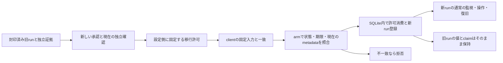

# Gate1 — UNKNOWNを保持した安全終了からの明示移行

状態: `DESIGN_REVIEW_READY`。単独primaryのレビュー済み提案であり、採用・実装・公開・配備・外部実行の承認ではない。

基準: 2026-09-12 JST、[PR840](https://github.com/kurodev-web-tools/tool-portal/pull/840)のPreview統合 `d33aeec41d4f3922a4e171a12454ac608767fe80`。統合先は `codex/comment-translator-paid-v1-preview`。同一タスクの単独primaryで設計する。

## 目的と今回の範囲

旧runのUNKNOWN、消費済み操作、`used_runs`の元の値、実行証拠を保持し、独立した安全終了確認に基づく一度の明示許可で、新しいrunを登録できるようにする。通常のpredecessor判定は変更しない。

最初の対象は実際のretry2と同じ「Preview pauseの結果がUNKNOWNとなり、Previewを復旧し、Recoveryは一度も起動していない」場合に限定する。Recoveryを起動したUNKNOWN、`PENDING`、`CLOSING`、`NEEDS_OPERATOR`への一般化は別仕様とする。安全終了は過去のAPI受理、正式停止、Hosted成功を証明しない。

今回の設計作業は現在のcleanなworktree `D:/V_streamer_tools/.worktrees/gate1-controller-provider-repair-20260912`を再利用し、新branch `codex/gate1-safe-closure-transition-20260912`で行う。ルートcheckout、終了済みclock worktree、SQLite namespace、旧試行の承認・credential・操作枠を再利用して実行しない。

## 確認できた現状

- PR840のhead `1e225ee8cf170ea02200dd1e9e1172fe5858f622`とmergeのGit treeは同じ。空応答修正と既存99件のローカル検証は保持される。これは配備確認ではない。
- 封印済みretry2の156証拠ファイル・保全5ファイルのSHA256が一致した。実終端stateは`RESTORED`、理由は`MUTATION_OUTCOME_UNKNOWN`、Preview pause/restoreは各1回・両方UNKNOWN、Recoveryの2操作は各0回。
- 現行`core.mjs`の`predecessorStateText`はこの実stateを拒否する。`worker.mjs`のsource変更後のGET/armとclientの開始前GET照合も同じ通常判定に依存している。provider修正を配備するだけでは新runを開始できない。
- 過去の独立した全内容・security比較、native/API確認、metadata確認、credential失効、disabled化、所有processの終了は証拠として残る。ただし過去の`safeToDisable: true`だけで現在の移行を許可しない。

## 方式の比較と選定

| 方式 | 評価 |
| --- | --- |
| **設定側で固定する一度の移行許可＋armへの明示指定** | 採用案。既存のCloudflare設定権限とoperator権限を区別でき、旧runを更新せず同じnamespaceで登録を監査できる。新しい鍵管理サービスは不要。 |
| 独立署名鍵でclosure証明書を発行しWorkerで署名検証 | 権限分離は可能だが、鍵配布・失効・署名運用を追加する。現行の承認された設定操作に対し、この段階では必要性がない。 |
| 通常predecessorの条件をRESTOREDのmetadataだけへ広げる | 採用しない。UNKNOWNに対する独立証拠と新しい承認の結合が失われる。 |

新しい任意設定値`CONTROLLER_SAFE_CLOSURE_GRANT_JSON`を使う。これを設定できるのは、当該操作を別途承認されたCloudflare設定側だけであり、controllerのHTTP callerがgrant本文を送って発行する経路は作らない。通常の`CONTROLLER_POLICY_JSON`の7項目、対象組織・project・mode・緊急復旧policyとnamespace選択はそのまま維持する。

## 不変条件

1. 旧UNKNOWNをACCEPTEDへ変えない。旧runを再開せず、旧操作を再送しない。
2. 旧`used_runs.value`はbyte単位で保持する。namespaceの作成し直し、台帳削除、PITRによる巻き戻しを使わない。
3. `predecessorStateText`と通常の`compatiblePredecessor`はUNKNOWNを引き続き拒否する。新しい経路にはgrantと明示inputの両方が必要。
4. 新runのIDは旧runと異なり未使用であること。通常のlease120秒、clientの20分上限、操作ごとに1claim、POST無再送、独立した正式停止証明を維持する。
5. grantは新runの登録許可に限る。Supabase操作、データ移送、正式停止、Hosted合格、Gate1のGOを直接許可しない。
6. 新run登録後は、grantの期限切れ・削除・破損が既存のcommand、abort、alarm、cleanupを妨げない。
7. 判定失敗を自動再試行の根拠にしない。応答が失われた場合も新runやgrantを自動で作り直さない。

## 対応する旧stateの厳密な形

新しい純粋関数`previewUnknownClosureStateText`を、通常判定とは別に用意する。次の条件を満たすpublic stateだけをcanonical化する。この関数単独の成功は移行許可ではない。

| 項目 | 必須条件 |
| --- | --- |
| schema | 既存public stateの12項目のみ。未知項目、欠落、重複JSON key、配列、型違反を拒否 |
| phase / reason | `RESTORED` / `MUTATION_OUTCOME_UNKNOWN` |
| Preview pause | `attempts: 1, outcome: UNKNOWN` |
| Preview restore | `attempts: 1, outcome: UNKNOWN`または`ACCEPTED` |
| Recovery restore / pause | それぞれ`attempts: 0, outcome: null` |
| projects | Preview `ACTIVE_HEALTHY`、Recovery `INACTIVE` |
| timestamps / sequence | 既存の非負safe integer・lease/hardEnd・sequence上限の検証を維持。観測時刻は両方とも非null |
| gate / formalStopAccepted | `NO-GO` / `false` |

Workerはさらに旧internal stateのschemaVersion、sourceとpolicyの一致、対象の固定、旧`used_runs`行との完全一致を検証する。JSONのobject keyを再帰的に辞書順へ整列して空白なしで文字列化し、そのUTF-8のSHA256を`predecessor.stateSha256`とする。旧HTTP応答本文のdigestとは区別する。

## 証拠の検証とgrantを発行する権限

独立確認はcontrollerから離れたローカルの検証工程で実施する。既存の正式停止proofと同様に、検証関数が返したfreeze済みobjectをmodule内のWeakSetで識別し、callerが作ったbooleanやJSON objectを「検証済み」として受け取らない。processを再開した場合は証拠を再検証する。

### A. 過去の安全終了証拠

新しいレビュー済みpacketに、旧final receiptのdigest、旧run/source、canonical state digest、旧manifest/bundle、証拠producerのsource digestを固定する。verifierは次を確認する。

- final receiptの`executionAllocationClosed`、run/sourceとterminal state、上表の操作数が一致すること。
- receiptに列挙された全証拠と保全ファイルのbytes/SHA256を照合すること。安全終了のsummaryだけを入力にしない。欠落・変更・symlink・root外参照は、packetで明示した保全先を除き拒否する。
- Previewの全対象relationの内容とsecurityがpause前の保全に一致すること。schema/row hashの比較結果、native PostgreSQL TLS、hostname不一致拒否、Auth/APIの期待した応答を、それぞれのproducerの完全なreceiptから検証すること。
- Recovery lifecycle、configuration write、synthetic user/transferが0であり、Production SQL/configに触れていないこと。
- 別経路のmetadataが対象・組織・region・engineを照合し、Preview正常・Recovery停止・Production正常を記録していること。
- 同namespaceのcontrollerがdisabled、旧runtime secretの撤去、PAT失効の401、OAuth失効、旧所有process/container/volumeの終了が実証されていること。
- 正式停止とHosted合格がfalseのままであること。`safeToDisable`や`previewRestored`のsummary値だけで不足を補わない。

現在のretry2形式に対応するadapterを明示的に1つ用意する。未登録のreceipt形式やproducerを推測で受理しない。hashは証拠の同一性を結ぶものであり、producerを正しく実行したことの署名ではない。独立producerの起動・完了と出力の由来をprimaryが確認する責務は残る。

証拠indexは1MiB以下・最大512entry、JSON receiptは各1MiB以下、参照bytes合計は1GiB以下とする。archiveのdigestはstreamで計算し、宣言されたbytesと実際の長さを照合する。receipt内の自由なURLを取得したり、SQL・shell・path指定を実行したりしない。

### B. 新しい承認後の現在確認

過去のreceiptは現在の健康状態を証明しない。新しい外部実行を承認された後、別の現在確認を実行し、そのfresh evidenceをgrantへ結ぶ。

1. 旧controllerのversion・disabled状態・namespaceと旧run台帳の保全を照合する。旧所有processが終了し、旧credentialを再使用していないことを確認する。
2. Previewの全内容/securityを保全と比較し、native/API確認を行う。差分がある場合は自動で基準を更新しない。
3. 10秒以上30秒以内の間隔で、独立経路による2回のPreview正常・Recovery停止・Production正常確認を行う。両回で対象を照合する。providerの失敗や中間状態は拒否する。
4. 全工程の完了後にgrantを生成し、Bのfresh evidenceの最も古い必要観測から5分以内にarmする。期限が足りない場合は延期や自動更新をせず、その実行枠を停止する。

Worker側ではさらに、旧runの`max(hardEndAt, cleanupEnd) + 60000`を過ぎていることを自分の時計で確認する。これは旧期限後の観測期間を確保する条件であり、過去のUNKNOWN要求がprovider内部で完全に消えた証明ではない。新規開始の明示承認は、その残る不確実性を含む独立した管理判断である。新runの開始直前にも現在のmetadataを再確認する。

## grantの形とdigest

grantは重複keyのないcanonical JSON、UTF-8で4096bytes以下、以下のkeyのみとする。ID/digestは小文字hex64、source commitは小文字hex40、時刻は非負safe integer。

| key | 値・結合先 |
| --- | --- |
| `schemaVersion` | `1` |
| `kind` | `PREVIEW_ONLY_UNKNOWN_SAFE_CLOSURE_V1` |
| `grantId` | この承認で新しく生成した未使用ID |
| `predecessor` | 既存の`{runId, sourceCommit, stateSha256}`の3項目 |
| `successor` | `{runId, sourceCommit, hardEndAt, manifestSha256}`の4項目。新しい実行枠に一致 |
| `policySha256` | 新sourceを含む現在の全policyのcanonical digest |
| `approvalSha256` | 新しい明示承認receiptのdigest |
| `closureEvidenceSha256` | AとBの検証済み証拠indexのcanonical digest |
| `issuedAt` | grantを生成したローカル工程の時刻。監査用 |
| `expiresAt` | 下記の期限計算による登録期限 |

grantのdigestは`SHA256(UTF8("gate1-safe-closure-grant-v1\n" + canonicalGrantJson))`、policyのdigestは`SHA256(UTF8("gate1-controller-policy-v1\n" + canonicalPolicyJson))`とする。JSON文字列の二重encode、別のkey順、空白、未知項目を自動正規化して受け入れず、生成側と検証側で同じcanonical bytesを要求する。

証拠indexの配列は配列のまま順序を保持し、objectへ変換しない。object keyだけを辞書順に整列する。indexのartifact IDと正規化した参照pathは重複を拒否し、保全ファイルの外部参照はpacketに列挙したものだけを使う。

grant生成時の`expiresAt`は「新しい承認の期限」「issuedAtから5分」「必要なfresh evidenceの最も古い観測から5分」の最小値とする。新runの`hardEndAt`は承認期限以内かつ登録時点から20分以内。grantは設定側で固定し、clientには同じgrant bytesを固定入力として渡す。

canonical grantの検証でも`issuedAt < expiresAt`および`expiresAt - issuedAt <= 300000`を必須とする。new sourceはこの設計を実装して受入れ・公開した将来のcommitへ固定し、設計の基準commitを実装済みsourceとして扱わない。

循環参照を作らない。静的execution manifestはsource/bundle、検証producer、旧証拠index、grantの生成規則を固定し、後から生成されるapproval、fresh evidence、grant本体を含めない。approvalはそのmanifestと旧/新runの結合を承認し、grantはapprovalとfresh evidenceを参照する。生成後のgrant bytesのdigestはruntime receiptとclientの固定入力へ記録する。旧approvalや旧manifestを新しい許可として流用しない。

### 時計の扱い

- ローカルverifierとclientは、自工程の時計でissuedAt・freshness・期限を検証し、時計が逆行したら停止する。
- WorkerはPCのissuedAtや観測時刻を自分の現在時刻と直接比較しない。登録直前の自分の時計で`0 < expiresAt - now <= 600000`を検証する。ローカル発行上限5分とWorkerの最大残存10分を区別し、数百msの時計差を新たな拒否原因にしない。
- Workerが取得するmetadataの開始/完了時刻と10秒の鮮度は、既存providerのWorker時計で検証する。新runの既存preservation時刻検証は変更しない。
- grantの期限を更新する操作は設けない。期限切れ後の新規登録には、新しい承認と確認が必要。

## HTTPとclientの変更

新しいHTTP endpointは作らず、既存の認証・route allowlist・サイズ上限を維持する。

`POST /v1/arm`に、任意の`safeClosure: {grantSha256, manifestSha256}`を追加する。これは`predecessor`が存在する場合だけ指定できる。通常のarmはこの項目を省略する。入力にgrant全文、証拠のboolean、target、namespace、追加URLを含めない。

clientはconstructorでpredecessorとgrantの結合、自己のrun/source/hardEnd/manifestを照合し、deep copyとfreezeで固定する。開始前GETは、通常経路なら従来関数、明示safeClosure経路なら新しい限定関数で旧stateのdigestを照合する。旧sequence/leaseを引き継がない。HTTP送信前journalにgrant digestを記録し、armで2つのdigestを一度だけ送る。UNKNOWN旧stateの照合は`SAFE_CLOSURE_PREDECESSOR_MATCHED`として記録し、通常の`PREDECESSOR_ACCEPTED`と混同しない。応答後の新stateは既存schemaのまま、sequence0・操作数0・現在のmetadataを検証する。

`GET /v1/state`は読み取りのみを維持する。source変更後の限定旧stateを返す場合は、設定grantの構造・対象policy・旧run/source/state digestとの一致を要求する。登録期限を過ぎたgrantでも、この固定された旧stateの読み取りだけは許可する。operator認証は常に必要で、期限切れgrantによるarmは拒否する。digest計算でawaitした後はcaptured internal stateが変わっていないことを再確認する。読み取りでgrantを消費したり、観測時刻・lease・台帳を更新しない。

grantが当該旧stateに一致する認証済みGETには、`X-Controller-Safe-Closure-Grant-Sha256` response headerを付ける。clientはarmを送る前にこの値を固定grant digestと照合する。秘密設定の名前が存在するだけで、正しい値が配備されたと判断しない。bodyは既存の12項目のまま。内部RPCはstateと検証したdigestを同じsnapshotから返す構造とし、外側のWorkerが別のenv値を計算してheaderへ入れない。通常のstateや認証失敗・disabled応答ではこのheaderを付けない。

同一sourceの旧UNKNOWNを読む場合も、正しいgrantがこの旧stateを指すときだけheaderを返す。grantが不正でも従来の同一policyの読み取りは維持できるが、headerを確認できない新clientはsafeClosure armを送らない。新run登録後のGETはheaderを要求せず、従来どおりそのrunのstateを検証する。

sourceが現在のrunと一致する通常のstate/command/cleanupはgrantを読み込まない。欠落・不正・期限切れの任意grant設定が、すでに登録済みのrunの復旧を止める構造にしない。

## Workerの登録処理と永続化

constructorにappend-only監査table `safe_closure_transitions`を追加する。`grant_id`をPRIMARY KEY、`prior_run_id`と`successor_run_id`と`grant_sha256`をそれぞれUNIQUEとし、grantのcanonical bytes、旧public stateのcanonical bytes、closure evidence digest、登録時刻を記録する。未知の既存table形は安全に失敗させる。namespace migration、旧rowの更新・削除、grant rowの更新・削除は行わない。

safeClosure指定のarmだけが次の順序を通る。

1. 認証・packet・policy・new runの構造を検証する。限定profile、設定grant、入力2digest、旧/新run/source/hardEnd/policyを照合する。通常経路への自動fallbackはしない。
2. 旧internal stateと`used_runs`の値をcaptureし、canonical state/grant/policyのdigestを計算する。grantの期限と旧runの期限後条件を確認する。
3. 固定されたPreview/Recoveryの現在metadataを各1回GETする。非200・UNKNOWN・対象不一致・期限切れは拒否する。この経路では通常armよりprovider GETが2回増えるため、次の外部packetに明記する。pause/restoreは発行しない。
4. 同期SQLite transaction内で、captured internal stateと旧`used_runs`の値の完全一致、当該instanceが参照する設定grant bytes、期限、metadataの10秒鮮度を再確認する。新run IDとgrant IDと旧runの移行記録が未使用であることを確認する。
5. 同じtransactionでgrant消費記録、新しい`used_runs`行、current slotを登録する。旧`used_runs`行は書き換えない。Workerが検証した新internal stateにだけ、通常predecessorと`safeClosureTransition: {grantId, grantSha256, manifestSha256, closureEvidenceSha256}`を保持し、public stateには項目を追加しない。callerの入力をこの内部markerとしてコピーしない。
6. 既存のalarm設定・初期metadata再読・初期状態拒否をそのまま行う。登録後に失敗してもgrantを未使用へ戻さない。clientはGETで状態を確認し、新runの既存abort/cleanupへ進む。

Cloudflareの[transactionSync](https://developers.cloudflare.com/durable-objects/api/sqlite-storage-api/#transactionsync)は同期callback内で例外が起きた場合にrollbackする。hash計算やネットワークawaitはtransactionの外へ置き、その後に全snapshotを再確認する。SQL cursorはawaitをまたいで保持しない。

失敗がtransaction前またはrollbackの場合は登録を消費しないが、clientの「送信したarmを再送しない」条件は変わらない。一度の許可とは成功するrun登録が最大1回という意味であり、拒否されたHTTP要求を無制限に再試行してよい意味ではない。

設定の更新・削除を、すでに進行中のRPCへの即時失効として扱わない。設定側の停止手順は新規armを止め、送信済み要求を未確認として保存し、現在のrunを読み戻してから終了を判断する。grantを消したことやHTTP timeoutだけを根拠に「新run未登録」と判定しない。期限のtransaction内再確認とIDの固定は、進行中要求にも適用する。

既存[alarm](https://developers.cloudflare.com/durable-objects/api/alarms/)は重複して実行され得る。過去のwakeが届いてもcurrent runと消費済みclaimの検証を維持し、新しい移行登録やgrantの再消費をalarmから起こさない。grantの期限後も新runのalarmを削除しない。

## 失敗時の扱い

| 状況 | 結果 |
| --- | --- |
| grantなし、入力だけ、grantだけ、profile違反、不一致 | 新しいUNKNOWN移行を拒否。通常の適格runの扱いは維持 |
| 期限切れ・時計逆行・metadata不明・証拠不足 | 新規登録を拒否。自動更新や再試行なし |
| 旧state/台帳/設定のdrift、競合したarm、使用済みID | 登録を拒否。旧rowを保持 |
| transaction中の任意write失敗 | grant、新run、current slotをすべてrollback。provider mutation0 |
| 登録後のalarm/観測失敗、HTTP応答喪失 | grantと新runは消費済みのまま。新しいIDを作らず、既存の観測・abort・cleanupへ進む |
| 新run登録後のgrant期限切れ・削除・破損 | 新runの復旧には影響しない。runtime operator/PATやpolicyを取り上げてよい意味ではない |
| 開始後に予想外のproject状態を観測 | 既存の拒否・abort・cleanupを適用。旧UNKNOWNを成功へ補正しない |

## 実装対象と責務

まだ実装しない。設計の受入れ後、同じ単独primaryが次の限定範囲を変更する。既存の依存を利用し、package/lock、Supabase schema、Cloudflare namespaceを変更しない。

| ファイル | 責務 |
| --- | --- |
| `workers/gate1-recovery-controller/safe-closure.mjs`（新規） | 限定旧state、grant、canonical bytes、policy結合、期限判定。NodeとWorkerで共有できる純粋関数 |
| `workers/gate1-recovery-controller/core.mjs` | armの任意safeClosure入力の構造検証。通常predecessorの条件は維持。grantの認可や内部markerの生成は行わない |
| `workers/gate1-recovery-controller/worker.mjs` | optional grantの限定読み込み、GETの固定旧state表示、現在metadataとtransaction、監査table |
| `scripts/lib/comment-translator-paid-core-v1-gate1-safe-closure.mjs`（新規） | 旧/fresh evidenceの登録済み形式を検証し、brand付きproofからだけgrantを生成。秘密値・生payloadを出力しない |
| `scripts/lib/comment-translator-paid-core-v1-gate1-controller-client.mjs` | grant固定、開始前state照合、既存armへ明示digestを追加。通常経路と正式停止proofは維持 |
| 対応するunit/integration tests、Worker README、task/運用記録 | 下記受入れ条件と外部操作の承認境界を残す |

既存のcontroller stop-proof、native/API停止判定、provider応答契約、generic SQL/HTTP executorは変更対象にしない。旧retry2の`.tmp` helpersを直接書き換えず、新しい検証adapterから読み取り専用で参照する。

依存方向は`safe-closure.mjs → core.mjs`とし、coreから新moduleをimportしない。WorkerとNode側client/helperが両者を使用する。新しいgrant validatorの参照が循環しないようにする。

## 実装後の受入れ条件

以下は**今後実行する検証**であり、この設計段階でpassしたものではない。基準の既存99件は、現行実装の検証として別に保持する。

| ID | 必須検証 |
| --- | --- |
| A01 | 旧実stateのSHA照合を維持し、従来関数では拒否、新限定canonicalizerでは同じdigestを生成。過去の本文・台帳に書き込みなし。実証拠replayはローカル限定とし、CIは同型のsynthetic fixtureを使う |
| A02 | Preview pause UNKNOWN/restore UNKNOWNまたはACCEPTEDだけを扱う。Recoveryの任意attempt、PENDING、NEEDS_OPERATOR、未終端、未知項目を拒否 |
| A03 | grantの欠落、別profile、重複key、過大入力、case/型/時刻違反、hash/旧新run/source/policy/manifest/hardEnd不一致を拒否 |
| A04 | producer/receiptの未登録形式、証拠欠落・改変・部分応答・安全終了summaryだけ・偽のproof・structuredCloneしたproofを拒否 |
| A05 | 新承認なし、旧承認、現在確認不足、必要観測の5分超過、期限の自動延長を拒否。正しい証拠でもnamespace/対象のdriftは拒否 |
| A06 | PCとWorkerの小さな時計差を新しいissuedAt比較で拒否しない。Worker登録期限・最長残存10分・旧期限後60秒をtransaction時にも検証 |
| A07 | 初期の空namespaceや通常の適格predecessorにsafeClosureを指定した場合は拒否。通常の旧client/packetと既存predecessor testsを保持 |
| A08 | 明示grant付きのsource変更前後GETが同じ固定stateと正しいdigest headerを返し、bytes、lease、観測時刻、grant rowを変更しない。期限切れGETとarm拒否を区別。unauth/disabled/通常runにheaderを出さない |
| A09 | 実Miniflare/workerd/SQLiteで正しい限定移行を1回登録し、旧used_runsの値がbyte一致、new sequence0・全attempt0・grant row1となる |
| A10 | 登録前のmetadata不明・対象不一致、hash中の旧state変化、旧台帳欠損/改変、grant変更を拒否。現在確認以外のprovider呼出しなし |
| A11 | 同時armと重複送信・応答喪失後の再送・run/grant/旧runの使い回しで、2つ目の登録とmutationを発生させない |
| A12 | grant insert、new used_runs insert、current slot writeの各位置で本物のSQLite失敗を起こし、transaction全体がrollbackする |
| A13 | 登録後のalarm/初期観測失敗は消費済みのまま。grant削除・不正値・期限切れ後も新runのabort/cleanupが動作する |
| A14 | 実clientがfrozen grantとpredecessorを送る。constructor後のcaller変更、違うmanifest、初期GETのdrift、header欠落/不一致、旧sequence/lease採用を拒否。GETで不一致ならarm送信0 |
| A15 | simulationとsynthetic outbound fixtureだけで4操作各1回の新run、reload、古いalarm、重複command拒否を確認。Supabase通信0 |
| A16 | 元の99件を含む関連suite、Worker/client/helper lint・構文、operator contract、disabled simulation dry-run、実差分のprimary reviewを通す |

## 実装から外部実行までの判断点

この文書の受入れ後にローカル実装と上記検証を行う。Git公開とmerge、optional grantを含む設定、配備、fresh evidenceを得る外部読み取り、credential、新しい1回のHosted試行はそれぞれ既存の明示承認範囲で行う。設定値が増え、provider GETが追加されるため、以前の実行packetを流用せず、新しい具体的な上限・source/bundle・grant生成規則を固定する。

grant設定を外部で実施する前に、受入れ済みコードのartifact identityと既存namespaceを照合する。設定・配備後は認証済みGETの旧stateとdigest headerを照合し、相違があればarmを送らない。正常な新runが稼働中なら、その復旧に必要なcredential、policy、alarmを保持する。安全終了後のgrant撤去は許可を消すだけで、消費記録を消さない。

この設計の完了は`DESIGN_REVIEW_READY`であり、`LOCAL_IMPLEMENTATION_ACCEPTED`、配備済み、正式停止成功、Hosted合格とは区別する。Gate1はNO-GOを維持する。
