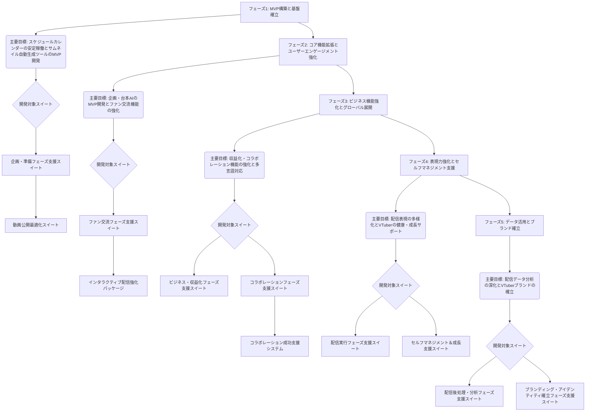

``# 事業計画ロードマップ

VTuber向けツール事業のロードマップです。各フェーズで開発・強化するスイートの企画書・設計書へリンクしています。

```mermaid
graph TD
    A[フェーズ1: MVP構築と基盤確立] --> B(主要目標: スケジュールカレンダーの安定稼働とサムネイル自動生成ツールのMVP開発)
    B --> C{開発対象スイート}
    C --> D[企画・準備フェーズ支援スイート]
    click D "フェーズごとの企画書・設計書/企画・準備フェーズ支援スイート_企画書.md"
    click D "フェーズごとの企画書・設計書/企画・準備フェーズ支援スイート_設計書.md"
    D --> D1[動画公開最適化スイート]
    click D1 "フェーズごとの企画書・設計書/企画・準備フェーズ支援スイート_企画書.md"
    click D1 "フェーズごとの企画書・設計書/企画・準備フェーズ支援スイート_設計書.md"

    A --> E[フェーズ2: コア機能拡張とユーザーエンゲージメント強化]
    E --> F(主要目標: 企画・台本AIのMVP開発とファン交流機能の強化)
    F --> G{開発対象スイート}
    G --> H[ファン交流フェーズ支援スイート]
    click H "フェーズごとの企画書・設計書/ファン交流フェーズ_企画書.md"
    click H "フェーズごとの企画書・設計書/ファン交流フェーズ_設計書.md"
    H --> H1[インタラクティブ配信強化パッケージ]
    click H1 "フェーズごとの企画書・設計書/ファン交流フェーズ_企画書.md"
    click H1 "フェーズごとの企画書・設計書/ファン交流フェーズ_設計書.md"

    E --> I[フェーズ3: ビジネス機能強化とグローバル展開]
    I --> J(主要目標: 収益化・コラボレーション機能の強化と多言語対応)
    J --> K{開発対象スイート}
    K --> L[ビジネス・収益化フェーズ支援スイート]
    click L "フェーズごとの企画書・設計書/ビジネス・収益化フェーズ_企画書.md"
    click L "フェーズごとの企画書・設計書/ビジネス・収益化フェーズ_設計書.md"
    K --> M[コラボレーションフェーズ支援スイート]
    click M "フェーズごとの企画書・設計書/コラボレーションフェーズ_企画書.md"
    click M "フェーズごとの企画書・設計書/コラボレーションフェーズ_設計書.md"
    M --> M1[コラボレーション成功支援システム]
    click M1 "フェーズごとの企画書・設計書/コラボレーションフェーズ_企画書.md"
    click M1 "フェーズごとの企画書・設計書/コラボレーションフェーズ_設計書.md"

    I --> N[フェーズ4: 表現力強化とセルフマネジメント支援]
    N --> O(主要目標: 配信表現の多様化とVTuberの健康・成長サポート)
    O --> P{開発対象スイート}
    P --> Q[配信実行フェーズ支援スイート]
    click Q "フェーズごとの企画書・設計書/配信実行フェーズ_企画書.md"
    click Q "フェーズごとの企画書・設計書/配信実行フェーズ_設計書.md"
    P --> R[セルフマネジメント＆成長支援スイート]
    click R "フェーズごとの企画書・設計書/セルフマネジメント＆成長支援スイート_企画書.md"
    click R "フェーズごとの企画書・設計書/セルフマネジメント＆成長支援スイート_設計書.md"

    N --> S[フェーズ5: データ活用とブランド確立]
    S --> T(主要目標: 配信データ分析の深化とVTuberブランドの確立)
    T --> U{開発対象スイート}
    U --> V[配信後処理・分析フェーズ支援スイート]
    click V "フェーズごとの企画書・設計書/配信後処理・分析フェーズ_企画書.md"
    click V "フェーズごとの企画書・設計書/配信後処理・分析フェーズ_設計書.md"
    U --> W[ブランディング・アイデンティティ確立フェーズ支援スイート]
    click W "フェーズごとの企画書・設計書/ブランディング・アイデンティティ確立フェーズ_企画書.md"
    click W "フェーズごとの企画書・設計書/ブランディング・アイデンティティ確立フェーズ_設計書.md"
```