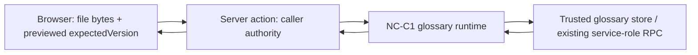

# Comment Translator Creator NC-X5 Bounded CSV Import Design

> 承認済みhandoffを唯一の要件源とする。これは既存NC-C1 glossaryへ全置換CSV importを追加する設計であり、AI suggestion、migration/apply、provider、Paid activation、deploy、commit、push、PRを承認しない。

## Goal

認証済みCreatorのserver-owned NC-C1 glossaryへ、厳密にboundedされたUTF-8 CSVをpreviewし、preview versionとのoptimistic concurrencyを再確認した上で、atomicな全置換を一度だけ適用する。previewとcancelはwrite-freeで、browserはfile bytesとpreviewで返されたexpectedVersion以外のauthorityを持たない。

## Component boundaries

### CSV parser and normalizer

`lib/comment-translator-creator-glossary-csv-import.ts` は `server-only` の依存なしstate machineとvalidationだけを持つ。

- byte lengthをUTF-8 decode前に128 KiB以下で確認する。
- optional UTF-8 BOMだけを許可し、UTF-16/32 BOMとinvalid UTF-8を拒否する。
- exact ordered header `language_scope,term,replacement,note` を要求する。
- quoted comma/quote/CRLF/LF、doubled quoteを扱い、bare CR、unclosed quote、closing quote後の不正data、unexpected columnを拒否する。
- data rowは1〜30、blank logical rowとheader-onlyを拒否する。
- NUL/disallowed control、cell bounds、既存NC-C1と同じNFKC/whitespace/language normalization、normalized `(languageScope, normalizedTerm)` collisionを全file fail-closedで検出する。
- NFKC後の先頭からleading whitespace/controlを除き、非空cellの先頭が `=`, `+`, `-`, `@` ならfile全体を拒否する。silent rewriteはしない。
- parserのfailure reasonは固定されたsanitized classだけを返し、raw cell、exception、private identifierを返さない。

成功時の内部rowは既存runtimeへ渡せる `term`, `replacement`, `note`, `languageScope`, `normalizedTerm` を持つ。actionがbrowserへ返すpreviewはこのうち4列の正規化済みsafe projectionだけにする。

### Server actions

`app/tools/comment-translator/glossary-actions.ts` は `"use server"` とし、次だけをauthorityとして使う。

1. `readCommentTranslatorCreatorActionCallerAuthority()` でcallerをserver-sideに導出する。
2. `createTrustedCommentTranslatorCreatorGlossaryStore()` でtrusted persistenceを取得する。
3. `createCommentTranslatorCreatorGlossaryRuntime({ glossaryStore })` で既存の30-term、normalization、expectedVersion、effectiveVersion、atomic RPC境界を再利用する。

`preview` はcallerと現在のglossary status/versionを読み、missing glossaryはexpectedVersion `0`、既存glossaryはそのversionを返し、bytesをserver-sideでparse/normalizeしてsafe previewを返す。writeは呼ばない。

`apply` はcaller/current versionを再確認し、同じoriginal bytesをserver-sideで再度bound/decode/parse/normalize/collision/injection検証する。preview rowsは信用しない。expectedVersionがstaleならwrite `0` で再previewを要求し、freshなら `runtime.replace(...)` をちょうど1回だけ呼ぶ。runtime/storeが返す内部reasonは固定sanitized action classへ写像し、owner、plan、Paid、provider、storage、private ref、DB error、raw row、secret、token、cookie、URL、stack、logをbrowserへ返さない。

cancelにserver actionは設けない。cancelはpanel内のfile bytes、file label、preview、statusだけをclearし、server mutationとbrowser storageを一切行わない。

### Client panel

`components/comment-translator/CommentTranslatorCreatorGlossaryImportPanel.tsx` はclient-memory-onlyのprops-light panelとする。

- file選択時はFileをbytesへ読み込むだけで、preview/applyを自動実行しない。
- previewがreadyになるまでApplyをdisabledにする。
- Applyは明示的なbutton操作だけで、同じbytesとpreviewed expectedVersionを送る。
- Cancelはcomponent stateだけをclearする。
- UIのerrorは固定classの文言だけで、action reasonのraw表示をしない。
- localStorage、sessionStorage、indexedDB、query authority、owner/plan/provider/storage authority、独自Paid activation、production navigation wiringを持たない。
- deterministic/fixed-closedな表示境界として実装し、既存routeへ自動接続しない。

## Data flow

Previewは `B -> P -> R/S read -> P parse -> B` でwrite 0。Applyは `B -> P -> R/S read -> P reparse -> R.replace once -> S atomic replace -> B` とし、stale/unavailable/invalidはreplace前に固定closedする。browserからowner id、entitlement、provider target、storage、activation stateを受け取らない。

## Failure behavior

| 状態 | browser-visible result | write |
| --- | --- | ---: |
| unauthenticated / auth unavailable | fixed unavailable class | 0 |
| trusted store unavailable / unreadable | fixed unavailable class | 0 |
| missing glossary during preview/apply | preview expectedVersion `0` | 0 / fresh applyのみ1 |
| invalid encoding/CSV/bound/injection/collision | fixed invalid-file class | 0 |
| preview version stale | stale; re-preview required | 0 |
| valid fresh apply | updated version/effectiveVersion/term count | 1 |

No partial write、silent truncation、merge/upsert/add-only、AI suggestion、provider call、new table/RPC/migration、R2、browser DBを導入しない。

## Verification contract

focused contractはRED→GREENで、valid UTF-8/BOM/CRLF/LF/quoted comma/quote/newline/Unicode/empty-note、invalid UTF-8/UTF-16/32/NUL/control/bare CR/unclosed/trailing quote/blank/header variants、byte/row/cell bounds、NFKC/language normalization/collision/injection、preview/cancel write 0、apply reparse、unauth/unavailable/unreadable write 0、missing expectedVersion 0、existing version、stale write 0、valid single replace、server-derived owner、authority/storage/browser boundaryを検査する。

NC-C1 glossary、current-task reconciliation、NC-F1/NC-E1/NC-P1/NC-Q1およびsecurity/token/session/browser-authority系の既存contractを広域検証する。`node_modules` が無ければinstallせず、lint/typecheck/build/OpenNextはsetup-blockedと記録する。commit、push、PR、merge、deploy、activation、cleanupはこのtaskの完了条件ではない。
