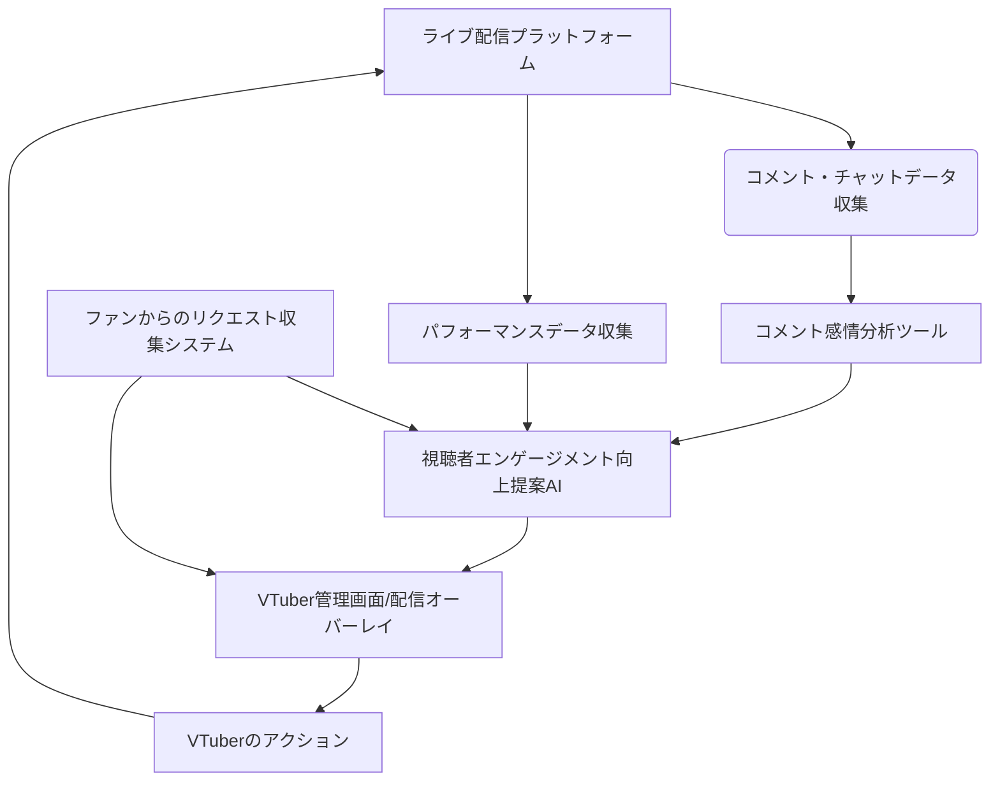

# インタラクティブ配信強化パッケージ 設計書

## 連鎖ツール名
インタラクティブ配信強化パッケージ

## 目的
VTuberのライブ配信において、視聴者とのリアルタイムなインタラクションを最大化し、エンゲージメントとコミュニティの活性化を促進する。AIによるコメント分析と提案、およびファンからのリクエストの効率的な取り込みを通じて、より魅力的で参加型の配信体験を提供する。

## 連携概要
本パッケージは、以下の3つの主要ツールが連携し、VTuberと視聴者間の双方向コミュニケーションを強化する。
1.  **コメント感情分析ツール:** 配信中のコメントをリアルタイムで分析し、感情や話題の傾向を把握。
2.  **視聴者エンゲージメント向上提案AI:** コメント分析結果と過去の配信データに基づき、VTuberへの具体的なアクション（返答内容、話題転換、企画提案など）を提示。
3.  **ファンからのリクエスト収集システム:** 配信外でファンから寄せられたリクエストやアイデアを管理し、配信内容に反映させる。

これらのツールは、リアルタイムデータと蓄積されたデータを連携させ、VTuberが視聴者のニーズに即座に応え、配信をより魅力的にするための支援を行う。

## データフロー
1.  **コメント・チャットデータ収集:** ライブ配信プラットフォーム（YouTube Live, Twitchなど）からコメント・チャットデータをリアルタイムで収集。
2.  **コメント感情分析ツール:** 収集されたコメントデータをリアルタイムで処理し、感情分析、キーワード抽出、話題のトレンド分析を行う。分析結果はシステム内部に保存され、視聴者エンゲージメント向上提案AIに連携される。
3.  **視聴者エンゲージメント向上提案AI:**
    *   コメント感情分析ツールからのリアルタイムデータを受け取り、VTuberへの返答内容、話題転換、視聴者参加型企画などの提案を生成。
    *   過去の配信データ（コメントログ、視聴者反応、提案採用履歴など）を学習し、提案の精度を向上させる。
    *   提案はVTuberの管理画面または配信画面オーバーレイに表示される。
4.  **ファンからのリクエスト収集システム:**
    *   ファンからのリクエスト（企画案、歌のリクエストなど）を収集し、データベースに保存。
    *   VTuberは管理画面からリクエストを閲覧・管理し、配信内容に組み込むことを検討。
    *   視聴者エンゲージメント向上提案AIは、リクエストシステム内のデータも参照し、関連する提案を行う。
5.  **VTuberのアクション:** VTuberは提案やリクエストを参考に、視聴者への返答、話題の変更、企画の実施などを行う。
6.  **パフォーマンスフィードバック:** VTuberのアクションに対する視聴者の反応（コメント数、スパチャ、視聴維持率など）を収集し、各ツールの学習データとして利用し、継続的な精度向上を図る。

## 技術的連携方法
*   **API連携:** 各ツールはRESTful APIを通じて相互に連携し、データの送受信を行う。特にリアルタイムデータはWebSocketなどを利用。
*   **メッセージキュー:** リアルタイムコメントデータやAIからの提案など、低遅延性が求められるデータ連携にはメッセージキュー（例：Kafka, RabbitMQ）を利用。
*   **共通データストア:** コメントログ、分析結果、提案履歴、リクエストデータなどは共通のデータベースに保存され、各ツールからアクセス可能とする。
*   **認証・認可:** 各ツール間のAPI呼び出しには、OAuth2.0などのセキュアな認証・認可メカニズムを導入。

## システム全体像

## 開発ロードマップ（連鎖視点）
*   **フェーズ1 (MVP):** コメント感情分析ツールと視聴者エンゲージメント向上提案AIの基本的な連携（リアルタイム感情分析と返答提案）。ファンからのリクエスト収集システムは独立して動作。
*   **フェーズ2:** 視聴者エンゲージメント向上提案AIに、話題転換・企画提案機能を追加し、ファンからのリクエスト収集システムとのデータ連携を強化。
*   **フェーズ3:** パフォーマンスフィードバックループの構築とAIモデルの継続的な学習。他配信プラットフォームへの対応、より高度なインタラクション機能の追加。
