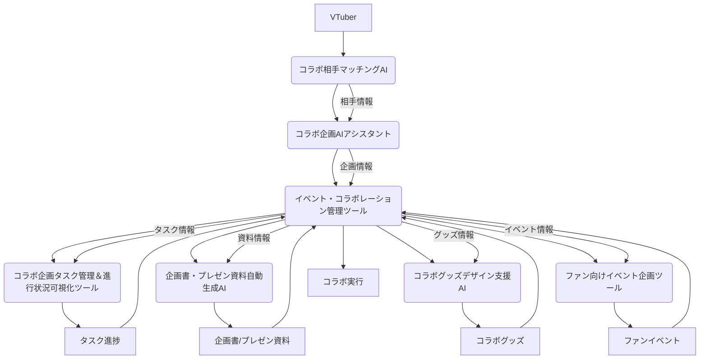

# コラボレーションフェーズ 設計書

## 連鎖ツール名
コラボレーション支援スイート

## 目的
VTuberが他のVTuberや企業とのコラボレーションを円滑に企画・実行できるよう、全プロセスを統合的に支援する。AIによる最適な相手選定、効率的な企画・タスク管理、プロフェッショナルな資料作成を通じて、コラボレーションの成功確率を最大化し、相互のチャンネル成長とファンエンゲージメントの向上に貢献する。

## 連携概要
本スイートは、以下の8つの主要ツールが連携し、VTuberのコラボレーションフェーズを多角的に支援する。
1.  **イベント・コラボレーション管理ツール:** コラボイベントの企画、進捗、参加者などを一元管理。
2.  **コラボ企画AIアシスタント:** コラボのアイデア出し、企画の骨子作成をAIが支援。
3.  **コラボ企画タスク管理＆進行状況可視化ツール:** コラボに関するタスクの割り当て、進捗状況を可視化。
4.  **企画書・プレゼン資料自動生成AI:** コラボの目的、内容、期待される効果などを盛り込んだ企画書を自動生成。
5.  **所属タレント横断コラボレーション最適化AI:** 事務所所属VTuber間のコラボを最適化（事務所向け）。
6.  **コラボグッズデザイン支援AI:** コラボグッズのデザインアイデア出しや制作を支援。
7.  **ファン向けイベント企画ツール:** ファンを巻き込んだコラボイベントの企画を支援。
8.  **コラボ相手マッチングAI:** VTuberの活動内容や目標に最適なコラボ相手を提案。

これらのツールは、コラボ相手の情報、企画内容、スケジュール、タスク、素材要件などを共有し、コラボレーションの企画から実行、そして成果の最大化までをシームレスに支援する。

## データフロー
1.  **コラボ相手選定:** VTuberは**コラボ相手マッチングAI**を利用し、自身の活動内容や目標に最適なコラボ相手を検索・選定する。AIは相手のプロフィール、活動実績、相性度などを提案する。
2.  **企画立案:** 選定された相手とのコラボ企画は、**コラボ企画AIアシスタント**がアイデア出しや企画の骨子作成を支援する。この情報は**イベント・コラボレーション管理ツール**に登録される。
3.  **スケジュール・タスク管理:** **イベント・コラボレーション管理ツール**でコラボの全体スケジュールと参加者を管理。詳細なタスクは**コラボ企画タスク管理＆進行状況可視化ツール**で割り当てられ、進捗が可視化される。**配信スケジュール自動調整ツール**（別スイートだが連携）と連携し、最適な日時を調整する。
4.  **資料作成:** 企画内容が固まったら、**企画書・プレゼン資料自動生成AI**が、コラボの目的、内容、期待される効果などを盛り込んだプロフェッショナルな企画書やプレゼン資料を自動生成する。
5.  **グッズ制作支援:** コラボグッズを制作する場合、**コラボグッズデザイン支援AI**がデザインアイデア出しや制作を支援する。
6.  **ファンイベント企画:** ファンを巻き込んだコラボイベントを企画する場合、**ファン向けイベント企画ツール**が企画立案を支援する。
7.  **情報共有:** 各ツールで生成・管理されたコラボ相手情報、企画内容、スケジュール、タスク、資料、グッズ情報などは、共通のデータストアを通じて相互に参照可能となり、関係者間でのスムーズな連携を促進する。
8.  **実績フィードバック:** コラボ終了後、成果やフィードバックは**イベント・コラボレーション管理ツール**に記録され、**コラボ相手マッチングAI**の学習データとして利用される。

## 技術的連携方法
*   **API連携:** 各ツールはRESTful APIを通じて相互に連携し、データの送受信を行う。
*   **共通データストア:** コラボ相手情報、企画データ、スケジュール、タスク、資料、グッズ情報などは、共通のデータベースに保存され、各ツールからアクセス可能とする。
*   **マイクロサービスアーキテクチャ:** 各ツールを独立したマイクロサービスとして構築し、疎結合な連携を実現することで、高い拡張性と保守性を確保する。

## システム全体像

## 開発ロードマップ（連鎖視点）
*   **フェーズ1 (MVP):** コラボ相手マッチングAIとコラボ企画AIアシスタントの基本的な連携。イベント・コラボレーション管理ツールへの手動登録。
*   **フェーズ2:** コラボ企画タスク管理＆進行状況可視化ツール、企画書・プレゼン資料自動生成AIの統合。自動化されたデータ連携の強化。
*   **フェーズ3:** コラボグッズデザイン支援AI、ファン向けイベント企画ツールの統合。所属タレント横断コラボレーション最適化AIとの連携（事務所向け）。各ツールのAIモデルの精度向上と、より密接な連携の実現。
