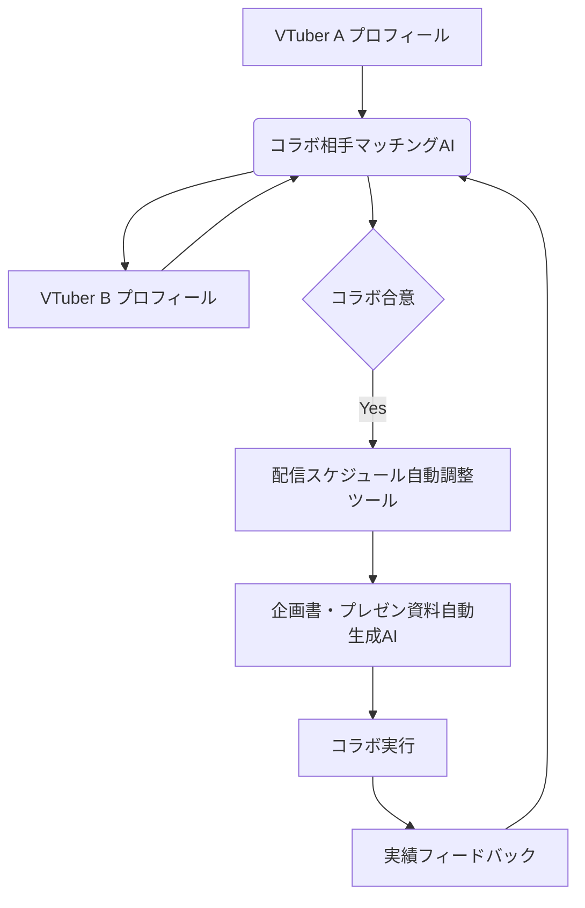

# コラボレーション成功支援システム 設計書

## 連鎖ツール名
コラボレーション成功支援システム

## 目的
VTuberがコラボレーションを企画・実行する際の全プロセスを効率化し、成功確率を最大化する。AIによる最適なコラボ相手の選定、自動化されたスケジュール調整、プロフェッショナルな企画書作成を通じて、VTuberがより多くの魅力的なコラボコンテンツを創出し、相互のチャンネル成長を促進する。

## 連携概要
本システムは、以下の3つの主要ツールが連携し、コラボレーションのライフサイクル全体をサポートする。
1.  **コラボ相手マッチングAI:** VTuberのプロフィールや活動内容に基づき、相性の良いコラボ相手を推薦。
2.  **配信スケジュール自動調整ツール:** マッチングしたVTuber間の空き状況を考慮し、最適なコラボ日時を自動で調整。
3.  **企画書・プレゼン資料自動生成AI:** コラボの目的、内容、期待される効果などを盛り込んだ資料を自動生成。

これらのツールは、コラボレーションの各フェーズで必要な情報を共有し、シームレスな連携によってVTuberの負担を軽減し、コラボの成功を後押しする。

## データフロー
1.  **コラボ相手検索・選定:** VTuberは自身のプロフィールを登録し、**コラボ相手マッチングAI**を利用してコラボ相手を検索・選定する。AIはVTuberの活動ジャンル、フォロワー数、配信スタイル、過去のコラボ実績などを考慮して相性の良い相手を提案する。
2.  **コラボ打診・合意:** 選定されたコラボ相手にツール内で打診を行い、コラボの合意を得る。この際、基本的なコラボ内容や希望日時などを共有する。
3.  **スケジュール調整:** 合意後、**配信スケジュール自動調整ツール**が起動。両VTuberの連携されたカレンダー情報（Googleカレンダーなど）を参照し、最適なコラボ日時を複数提案。両者の承認をもってスケジュールを確定し、カレンダーに自動登録する。
4.  **企画書作成:** スケジュール確定後、**企画書・プレゼン資料自動生成AI**が起動。コラボの目的、内容、参加VTuberの情報、確定したスケジュール、期待される効果などを入力として、プロフェッショナルな企画書やプレゼン資料を自動生成する。生成された資料は、関係者間での共有や最終確認に利用される。
5.  **コラボ実行:** 確定したスケジュールと企画書に基づき、コラボレーションが実行される。
6.  **実績フィードバック:** コラボ終了後、コラボの成果（視聴回数、登録者増加数など）や、コラボ相手との相性に関するフィードバックをシステムに登録。このデータはコラボ相手マッチングAIの学習データとして利用され、次回のマッチング精度向上に貢献する。

## 技術的連携方法
*   **API連携:** 各ツールはRESTful APIを通じて相互に連携し、データの送受信を行う。
*   **共通データストア:** VTuberプロフィール、コラボ履歴、スケジュール情報、企画書データなどは共通のデータベースまたはストレージに保存され、各ツールからアクセス可能とする。
*   **認証・認可:** 各ツール間のAPI呼び出しには、OAuth2.0などのセキュアな認証・認可メカニズムを導入。特にカレンダー連携やプラットフォームAPI連携には厳重なセキュリティ対策を講じる。

## システム全体像

## 開発ロードマップ（連鎖視点）
*   **フェーズ1 (MVP):** コラボ相手マッチングAIの基本的な機能と、配信スケジュール自動調整ツールの基本的な連携（手動でのデータ連携を含む）。企画書・プレゼン資料自動生成AIは独立して動作。
*   **フェーズ2:** 各ツール間のAPI連携を強化し、自動化されたデータフローを確立。企画書・プレゼン資料自動生成AIとスケジュール調整ツールの連携を強化。
*   **フェーズ3:** 実績フィードバック機能の実装と、AIモデルの継続的な学習。コラボレーション管理機能（タスク管理、進捗追跡など）の追加、他プラットフォーム連携の強化。
