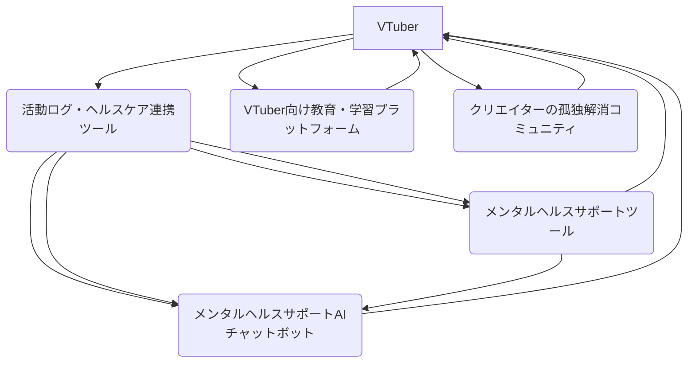

# セルフマネジメント＆成長支援スイート 設計書

## 連鎖ツール名
セルフマネジメント＆成長支援スイート

## 目的
VTuberが心身ともに健康な状態で活動を継続し、スキルアップを通じて持続的に成長できるよう支援する。メンタルヘルスケア、活動ログとヘルスケアの連携、教育・学習、そしてコミュニティを通じた多角的なサポートを提供し、VTuberのウェルビーイングとキャリアの長期化に貢献する。

## 連携概要
本スイートは、以下の5つの主要ツールが連携し、VTuberのセルフマネジメントと成長を支援する。
1.  **メンタルヘルスサポートツール:** VTuberのメンタルヘルス維持・向上を支援。
2.  **活動ログ・ヘルスケア連携ツール:** 活動データと健康データを連携し、心身の状態を可視化。
3.  **VTuber向け教育・学習プラットフォーム:** VTuber活動に必要な知識やスキルを習得できる学習コンテンツを提供。
4.  **クリエイターの孤独解消コミュニティ:** VTuber同士が交流し、悩みを共有できる場を提供。
5.  **メンタルヘルスサポートAIチャットボット:** VTuber特有のストレスに対応し、AIがカウンセリングやストレス解消法を提案。

これらのツールは、VTuberの活動状況、健康状態、学習進捗、そして精神的な状態に関する情報を共有し、個々のVTuberに合わせたパーソナライズされたサポートを提供する。

## データフロー
1.  **活動ログ・ヘルスケアデータ収集:** VTuberの活動データ（配信時間、コンテンツ制作時間など）とヘルスケアデータ（睡眠時間、心拍数など）は、**活動ログ・ヘルスケア連携ツール**を通じて収集され、一元的に管理される。このデータは、メンタルヘルスサポートツールやAIチャットボットの分析に利用される。
2.  **メンタルヘルスケア:** VTuberは、**メンタルヘルスサポートツール**を利用して自身の精神状態を記録・分析したり、**メンタルヘルスサポートAIチャットボット**に匿名で悩みを相談したりする。AIチャットボットは、ユーザーの状況に応じてストレス解消法や専門機関を提案する。
3.  **学習とスキルアップ:** VTuberは、**VTuber向け教育・学習プラットフォーム**で、配信技術、マーケティング、コミュニケーションスキルなど、活動に必要な知識やスキルを学ぶ。学習進捗は活動ログと連携される。
4.  **コミュニティ交流:** **クリエイターの孤独解消コミュニティ**を通じて、他のVTuberと交流し、情報交換や悩みの共有を行う。コミュニティでの活動は、メンタルヘルスにも良い影響を与える。
5.  **フィードバックループ:** 各ツールで得られたデータ（活動状況、健康状態、学習成果、メンタル状態）は、VTuber自身の自己理解を深め、より健康で持続可能な活動計画を立てるためのフィードバックとなる。また、各ツールのAIモデルの学習にも利用され、提案精度が向上する。

## 技術的連携方法
*   **API連携:** 各ツールは、ヘルスケアデバイス、学習プラットフォーム、コミュニティプラットフォームなどとAPIを通じて連携し、データの取得・送信を行う。
*   **共通データストア:** 活動ログ、ヘルスケアデータ、メンタル状態の記録、学習履歴などは、共通のデータベースに保存され、各ツールからアクセス可能とする。
*   **AIモデルの共有:** メンタルヘルスサポートAIチャットボットで利用されるAIモデルは、活動ログやヘルスケアデータも参照し、よりパーソナライズされた提案を行う。

## システム全体像

## 開発ロードマップ（連鎖視点）
*   **フェーズ1 (MVP):** 活動ログ・ヘルスケア連携ツールとメンタルヘルスサポートAIチャットボットの基本的な連携（活動データに基づいたストレスレベルの推定とチャットボットでの相談）。
*   **フェーズ2:** メンタルヘルスサポートツール、VTuber向け教育・学習プラットフォームの統合。より詳細なヘルスケアデータの連携。
*   **フェーズ3:** クリエイターの孤独解消コミュニティとの連携強化。各ツールのAIモデルの精度向上と、より密接なパーソナライズされたサポートの実現。
