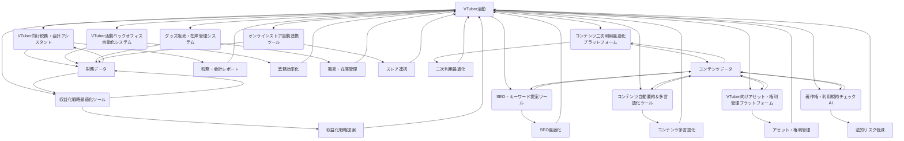

# ビジネス・収益化フェーズ 設計書

## 連鎖ツール名
ビジネス・収益化支援スイート

## 目的
VTuber活動における収益の最大化、バックオフィス業務の効率化、そして法務・税務リスクの管理を包括的に支援する。収益データの統合分析、税務・会計アシスタント、著作権・利用規約チェック、コンテンツの二次利用最適化を通じて、VTuberが安心して活動を継続し、ビジネスとしての成長を加速させる。

## 連携概要
本スイートは、以下の10の主要ツールが連携し、VTuberのビジネス・収益化フェーズを多角的に支援する。
1.  **VTuber活動バックオフィス自動化システム:** 日常の事務作業を自動化し、効率化。
2.  **グッズ販売・在庫管理システム:** グッズの販売から在庫、発送までを一元管理。
3.  **オンラインストア自動連携ツール:** 自身のオンラインストアと各種プラットフォームを連携。
4.  **コンテンツ二次利用最適化プラットフォーム:** 自身のコンテンツの二次利用に関する許諾や管理を最適化。
5.  **VTuber向けアセット・権利管理プラットフォーム:** 自身の著作物や契約に関するアセット・権利を一元管理。
6.  **SEO・キーワード提案ツール:** コンテンツの検索エンジン最適化を支援し、リーチを拡大。
7.  **コンテンツ自動要約＆多言語化ツール:** コンテンツを自動で要約し、多言語化してグローバル展開を支援。
8.  **著作権・利用規約チェックAI:** 使用素材の著作権・利用規約違反を自動チェックし、法的リスクを低減。
9.  **VTuber向け税務・会計アシスタント:** 収入・支出管理、確定申告支援、税務Q&Aを提供し、税務処理を簡素化。
10. **収益化戦略最適化ツール:** 複数の収益源を統合分析し、最適な収益化戦略を提案。

これらのツールは、財務データ、コンテンツデータ、法務関連情報などを共有し、VTuberのビジネス活動をデータに基づき、効率的かつ安全に推進する。

## データフロー
1.  **収益・費用データ収集:** VTuberの各収益源（YouTube、グッズ販売プラットフォームなど）からの収入データと、活動に伴う支出データは、**VTuber向け税務・会計アシスタント**と**収益化戦略最適化ツール**に自動連携または手動で入力される。**グッズ販売・在庫管理システム**や**オンラインストア自動連携ツール**からも販売データが連携される。
2.  **財務分析・戦略提案:** **収益化戦略最適化ツール**は、収集された収益・費用データを統合的に分析し、VTuberの目標に応じた最適な収益化戦略を提案する。**VTuber向け税務・会計アシスタント**は、これらのデータを元に収支を管理し、確定申告に必要な情報を整理する。
3.  **バックオフィス業務自動化:** **VTuber活動バックオフィス自動化システム**は、日常の事務作業を効率化し、財務データやスケジュールデータと連携して、各種レポート作成や通知を行う。
4.  **コンテンツの最適化・管理:**
    *   **SEO・キーワード提案ツール**は、コンテンツの検索流入を最大化するためのキーワードを提案。**コンテンツ自動要約＆多言語化ツール**は、コンテンツを要約・多言語化し、グローバルなリーチを拡大する。
    *   **コンテンツ二次利用最適化プラットフォーム**は、自身のコンテンツの二次利用に関する許諾や管理を効率化する。
    *   **VTuber向けアセット・権利管理プラットフォーム**は、自身の著作物や契約に関するアセット・権利を一元管理し、法務・税務アシスタントと連携してリスク管理を行う。
5.  **法的リスクチェック:** **著作権・利用規約チェックAI**は、コンテンツ制作に使用する素材が著作権や利用規約に違反していないかを自動でチェックし、法的リスクを未然に防ぐ。この情報は、アセット・権利管理プラットフォームにも連携される。
6.  **フィードバックループ:** 各ツールの分析結果や提案は、VTuberの活動改善にフィードバックされ、より効率的で収益性の高いビジネス運営に繋がる。

## 技術的連携方法
*   **API連携:** 各ツールは、金融機関、プラットフォーム（YouTube, ECサイト）、税務システムなどとAPIを通じて連携し、データの取得・送信を行う。
*   **共通データストア:** 財務データ、コンテンツデータ、法務関連情報などは、共通のデータベースまたはストレージに保存され、各ツールからアクセス可能とする。
*   **マイクロサービスアーキテクチャ:** 各ツールを独立したマイクロサービスとして構築し、疎結合な連携を実現することで、高い拡張性と保守性を確保する。

## システム全体像

## 開発ロードマップ（連鎖視点）
*   **フェーズ1 (MVP):** VTuber向け税務・会計アシスタントと収益化戦略最適化ツールの基本的な連携（主要収益源からのデータ統合、基本的な収益分析）。
*   **フェーズ2:** 著作権・利用規約チェックAI、VTuber活動バックオフィス自動化システムの統合。グッズ販売・在庫管理システム、オンラインストア自動連携ツールの連携。
*   **フェーズ3:** コンテンツ二次利用最適化プラットフォーム、VTuber向けアセット・権利管理プラットフォーム、SEO・キーワード提案ツール、コンテンツ自動要約＆多言語化ツールの統合。各ツールのAIモデルの精度向上と、より密接なデータ連携の実現。
