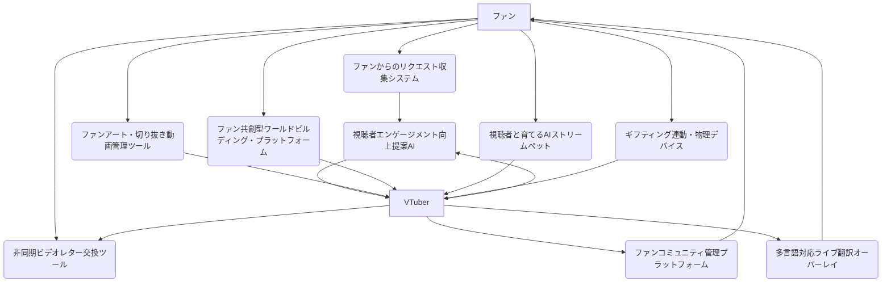

# ファン交流フェーズ 設計書

## 連鎖ツール名
ファン交流フェーズ支援スイート

## 目的
VTuberとファンとの多角的な交流を促進し、コミュニティの活性化とファンエンゲージメントの最大化を図る。リアルタイムの配信中から非同期コミュニケーション、二次創作活動の支援、そしてグローバルなファンとの交流まで、あらゆる接点でのファン体験を豊かにする。

## 連携概要
本スイートは、以下の9つの主要ツールが連携し、VTuberのファン交流を包括的に支援する。
1.  **ファンからのリクエスト収集システム:** ファンからの要望やアイデアを効率的に収集。
2.  **ファンコミュニティ管理プラットフォーム:** コミュニティ運営とメンバー管理を支援。
3.  **非同期ビデオレター交換ツール:** VTuberとファンが非同期でビデオメッセージを交換。
4.  **ギフティング連動・物理デバイス:** ギフティングと連動して物理的なデバイスが反応。
5.  **視聴者と育てるAIストリームペット:** 視聴者の行動に応じて成長するAIペット。
6.  **ファン共創型ワールドビルディング・プラットフォーム:** ファンと共にVTuberの世界観を構築。
7.  **視聴者エンゲージメント向上提案AI:** 配信中の視聴者エンゲージメントを高めるための具体的なアクションを提案。
8.  **ファンアート・切り抜き動画管理ツール:** ファンアートや切り抜き動画を自動検出し、管理・活用。
9.  **多言語対応ライブ翻訳オーバーレイ:** ライブ配信の音声を多言語にリアルタイム翻訳し、字幕表示。

これらのツールは、ファンからのインプット（リクエスト、二次創作）、VTuberからのアウトプット（ビデオレター、配信）、そしてリアルタイムのインタラクションを連携させ、ファンとの絆を深める。

## データフロー
1.  **ファンからのインプット:**
    *   ファンは**ファンからのリクエスト収集システム**を通じて、VTuberへのリクエストやアイデアを送信する。このデータは、**視聴者エンゲージメント向上提案AI**の提案内容にも影響を与える。
    *   ファンが作成したファンアートや切り抜き動画は、**ファンアート・切り抜き動画管理ツール**によって自動検出・収集され、VTuberが管理・承認する。
    *   **ファン共創型ワールドビルディング・プラットフォーム**を通じて、ファンはVTuberの世界観構築に貢献する。
2.  **VTuberからのアウトプット・交流:**
    *   VTuberは、**非同期ビデオレター交換ツール**を通じてファンにパーソナルなビデオメッセージを送る。
    *   **ファンコミュニティ管理プラットフォーム**を通じて、ファンとの日常的な交流や情報共有を行う。
    *   ライブ配信中、**視聴者エンゲージメント向上提案AI**が、コメント感情分析や過去のデータに基づき、VTuberにリアルタイムで返答内容や企画を提案する。これにより、VTuberはより効果的に視聴者と交流できる。
    *   海外の視聴者との交流を深めるため、**多言語対応ライブ翻訳オーバーレイ**がVTuberの音声を多言語に翻訳し、字幕として表示する。
    *   **ギフティング連動・物理デバイス**は、ファンからのギフティングにVTuberが物理的な反応で応えることで、インタラクションを強化する。
    *   **視聴者と育てるAIストリームペット**は、視聴者の行動に応じて成長し、ファンとの新たな交流の形を提供する。
3.  **フィードバックループ:** ファンからのリクエスト、二次創作の反応、配信中のエンゲージメントデータなどは、VTuberの活動改善や、各ツールのAIモデルの学習にフィードバックされ、よりパーソナライズされたファン交流体験の提供に繋がる。

## 技術的連携方法
*   **API連携:** 各ツールは、SNSプラットフォーム、配信プラットフォーム、ギフティングサービスなどとAPIを通じて連携し、データの送受信を行う。
*   **共通データストア:** ファンからのリクエスト、二次創作コンテンツ情報、コミュニティデータ、エンゲージメントデータなどは、共通のデータベースに保存され、各ツールからアクセス可能とする。
*   **リアルタイム通信:** ライブ配信中のインタラクション（コメント、提案、翻訳字幕）にはWebSocketなどのリアルタイム通信プロトコルを利用。

## システム全体像

## 開発ロードマップ（連鎖視点）
*   **フェーズ1 (MVP):** ファンからのリクエスト収集システム、ファンコミュニティ管理プラットフォーム、視聴者エンゲージメント向上提案AIの基本的な連携。
*   **フェーズ2:** 非同期ビデオレター交換ツール、ファンアート・切り抜き動画管理ツールの統合。多言語対応ライブ翻訳オーバーレイの統合。
*   **フェーズ3:** ギフティング連動・物理デバイス、視聴者と育てるAIストリームペット、ファン共創型ワールドビルディング・プラットフォームの統合。各ツールのAIモデルの精度向上と、より密接なリアルタイム連携の実現。
