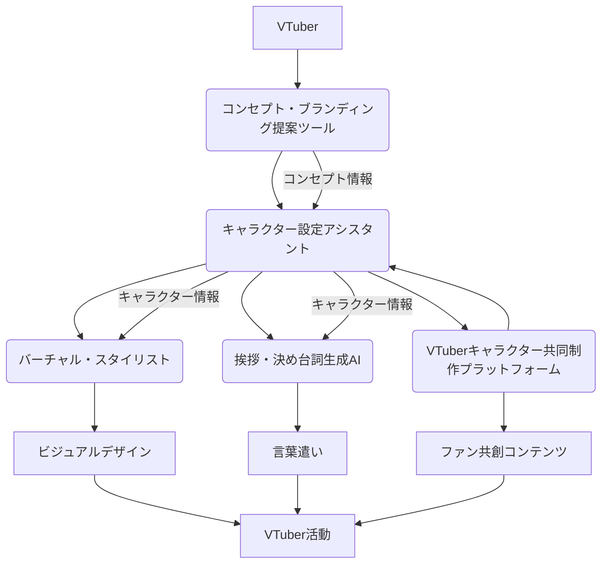

# ブランディング・アイデンティティ確立フェーズ 設計書

## 連鎖ツール名
ブランディング・アイデンティティ確立支援スイート

## 目的
VTuberが自身のキャラクター、コンセプト、そしてブランドイメージを明確に定義し、一貫性を持って活動できるよう支援する。AIによる多角的な提案とファンとの共創を通じて、VTuber独自の個性を際立たせ、視聴者に深く記憶される存在感を確立する。

## 連携概要
本スイートは、以下の5つの主要ツールが連携し、VTuberのブランディングとアイデンティティ確立を支援する。
1.  **キャラクター設定アシスタント:** VTuberのキャラクターの深掘り、設定の矛盾解消、新たな側面の発掘を支援。
2.  **コンセプト・ブランディング提案ツール:** VTuberの活動全体を統括するコンセプト、ターゲット層、ポジショニングなどを明確化。
3.  **バーチャル・スタイリスト:** キャラクター設定やコンセプトに基づき、衣装、ヘアスタイル、アクセサリーなどのビジュアル要素を提案。
4.  **挨拶・決め台詞生成AI:** キャラクターの個性やコンセプトに合致した挨拶や決め台詞を生成。
5.  **VTuberキャラクター共同制作プラットフォーム:** ファンを巻き込み、キャラクター設定や世界観を共に創造する。

これらのツールは、VTuberの「核」となる情報を共有し、一貫したブランドイメージを構築するための基盤を提供する。

## データフロー
1.  **コンセプト・ブランディング策定:** VTuberはまず**コンセプト・ブランディング提案ツール**を利用し、自身の活動の核となるコンセプト、ターゲット、提供価値などを明確にする。この情報は、スイート内の全てのツールの基盤となる。
2.  **キャラクター設定の深掘り:** 策定されたコンセプトに基づき、**キャラクター設定アシスタント**がVTuberのキャラクターの性格、背景、能力、口調などを詳細に設定する。AIは設定の矛盾を検出し、より魅力的なキャラクター像を提案する。
3.  **ビジュアルデザインの検討:** キャラクター設定とコンセプトに基づき、**バーチャル・スタイリスト**がVTuberの衣装やビジュアルデザインに関する提案を行う。AIはトレンドやキャラクターの個性を考慮したスタイリングを提案する。
4.  **言葉遣いの統一:** キャラクター設定とコンセプトに合致した、VTuber独自の**挨拶・決め台詞生成AI**が、印象的な挨拶や決め台詞を生成する。これにより、VTuberの言葉遣いに一貫性が生まれる。
5.  **ファンとの共創:** **VTuberキャラクター共同制作プラットフォーム**を通じて、ファンはVTuberのキャラクター設定や世界観の構築に直接参加する。ファンからのアイデアやフィードバックは、キャラクター設定アシスタントやコンセプト・ブランディング提案ツールにフィードバックされ、より魅力的なブランドへと進化させる。
6.  **情報共有:** 各ツールで生成・管理されたコンセプト、キャラクター設定、ビジュアル、言葉遣いなどの情報は、共通のデータストアを通じて相互に参照可能となり、VTuberは一貫したブランドイメージに基づいて活動を展開できる。

## 技術的連携方法
*   **API連携:** 各ツールはRESTful APIを通じて相互に連携し、データの送受信を行う。
*   **共通データストア:** コンセプト、キャラクター設定、ビジュアル要素、挨拶・決め台詞、ファンからの共創データなどは、共通のデータベースに保存され、各ツールからアクセス可能とする。
*   **AIモデルの共有:** 各ツールで利用されるAIモデルは、共通の基盤モデルをファインチューニングする形で共有し、一貫した提案ロジックを維持する。

## システム全体像

## 開発ロードマップ（連鎖視点）
*   **フェーズ1 (MVP):** コンセプト・ブランディング提案ツールとキャラクター設定アシスタントの基本的な連携。挨拶・決め台詞生成AIの統合。
*   **フェーズ2:** バーチャル・スタイリストの統合。VTuberキャラクター共同制作プラットフォームとの連携。
*   **フェーズ3:** 各ツールのAIモデルの精度向上と、より密接な連携の実現。ブランドガイドライン自動生成機能の追加。
