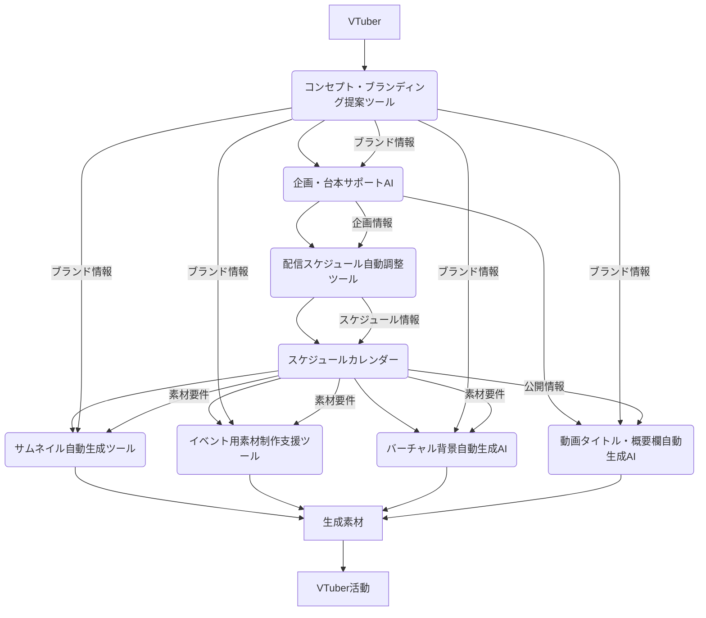

# 企画・準備フェーズ支援スイート 設計書

## 連鎖ツール名
企画・準備フェーズ支援スイート

## 目的
VTuberのコンテンツ企画立案から、配信・イベントスケジュールの管理、必要な素材準備、そして動画公開時の最適化までの一連のプロセスを統合的に支援し、効率化と品質向上を図る。各ツールの連携により、VTuberの作業負担を軽減し、クリエイティブな活動への集中を促す。

## 連携概要
本スイートは、以下の8つの主要ツールが連携し、VTuberの企画・準備フェーズを包括的にサポートする。
1.  **企画・台本サポートAI:** コンテンツのアイデア生成、台本作成、企画の骨子作成を支援。
2.  **配信スケジュール自動調整ツール:** コラボやイベントの最適な日時を自動で調整。
3.  **スケジュールカレンダー:** 全ての活動スケジュールを一元管理し、視覚的に表示。
4.  **サムネイル自動生成ツール:** 動画公開に必要なサムネイル画像を効率的に生成。
5.  **イベント用素材制作支援ツール:** 企画やイベントに必要な各種グラフィック素材の制作を支援。
6.  **動画タイトル・概要欄自動生成AI:** 動画公開時のタイトルと概要欄をAIが最適化。
7.  **コンセプト・ブランディング提案ツール:** VTuberのコンセプトやブランドイメージを明確化し、一貫性を保つ。
8.  **バーチャル背景自動生成AI:** 配信のテーマやキャラクターに合わせた背景画像を生成。

これらのツールは、企画内容、スケジュール情報、素材要件、ブランディング要素などを共有し、VTuberの準備プロセスをシームレスに連携させる。

## データフロー
1.  **コンセプト・ブランディング策定:** VTuberは**コンセプト・ブランディング提案ツール**を利用し、自身のブランドイメージや活動の方向性を明確にする。この情報は、他のツールの提案精度向上に利用される。
2.  **企画立案:** VTuberが**企画・台本サポートAI**を利用し、コンテンツのアイデア出しや台本作成を行う。AIは過去の活動データやトレンド、そしてVTuberのブランディング情報を分析し、企画案を提案する。
3.  **スケジュール調整:** 企画案が固まったら、**配信スケジュール自動調整ツール**を利用して、コラボ相手やイベント会場との最適な日時を調整する。確定したスケジュールは**スケジュールカレンダー**に自動で登録される。
4.  **スケジュール管理:** **スケジュールカレンダー**は、配信、イベント、コラボ、素材制作の締め切りなど、全ての活動スケジュールを一元的に管理し、VTuberにリマインダーや通知を行う。
5.  **素材準備:**
    *   動画公開が決まったら、**サムネイル自動生成ツール**を利用して、動画内容に合わせたサムネイル画像を生成する。この際、動画タイトル・概要欄自動生成AIで生成された情報や、コンセプト・ブランディング提案ツールで定義されたブランドイメージが考慮される。
    *   イベントや特別な企画の場合、**イベント用素材制作支援ツール**を利用して、告知バナー、ロゴ、背景などのグラフィック素材を制作する。ここでもブランディング情報が活用される。
    *   配信のビジュアルを強化するため、**バーチャル背景自動生成AI**を利用し、配信テーマやキャラクターに合わせた背景画像を生成する。
6.  **動画公開準備:** 動画公開時には、**動画タイトル・概要欄自動生成AI**が、企画内容、動画ファイル、そしてブランディング情報に基づいて、視聴者の目を引くタイトルと概要欄を生成する。
7.  **情報共有:** 各ツールで生成・管理された企画内容、スケジュール、素材情報、ブランディング情報は、共通のデータストアを通じて相互に参照可能となり、VTuberは一貫した情報に基づいて準備を進めることができる。
8.  **フィードバック:** 実際の活動結果や視聴者の反応は、将来の企画・台本サポートAIの提案精度向上や、スケジュール調整の最適化、動画公開時の最適化にフィードバックされる。

## 技術的連携方法
*   **API連携:** 各ツールはRESTful APIを通じて相互に連携し、データの送受信を行う。
*   **共通データストア:** 企画データ、スケジュールデータ、素材要件、生成された素材、ブランディング情報などは、共通のデータベースまたはストレージに保存され、各ツールからアクセス可能とする。
*   **メッセージキュー:** スケジュール変更通知や素材生成完了通知など、非同期処理やリアルタイム通知が必要な場合は、メッセージキューを利用してツール間の連携を行う。
*   **認証・認可:** 各ツール間のAPI呼び出しには、OAuth2.0などのセキュアな認証・認可メカニズムを導入。

## システム全体像

## 開発ロードマップ（連鎖視点）
*   **フェーズ1 (MVP):** 企画・台本サポートAIとスケジュールカレンダーの基本的な連携（企画内容の手動連携、スケジュールへの反映）。配信スケジュール自動調整ツールとの連携。
*   **フェーズ2:** サムネイル自動生成ツール、動画タイトル・概要欄自動生成AIの統合。コンセプト・ブランディング提案ツールとの連携（ブランディング情報の活用）。
*   **フェーズ3:** イベント用素材制作支援ツール、バーチャル背景自動生成AIの統合。各ツール間のデータ連携の自動化とAIによる最適化の強化。フィードバックループの構築。