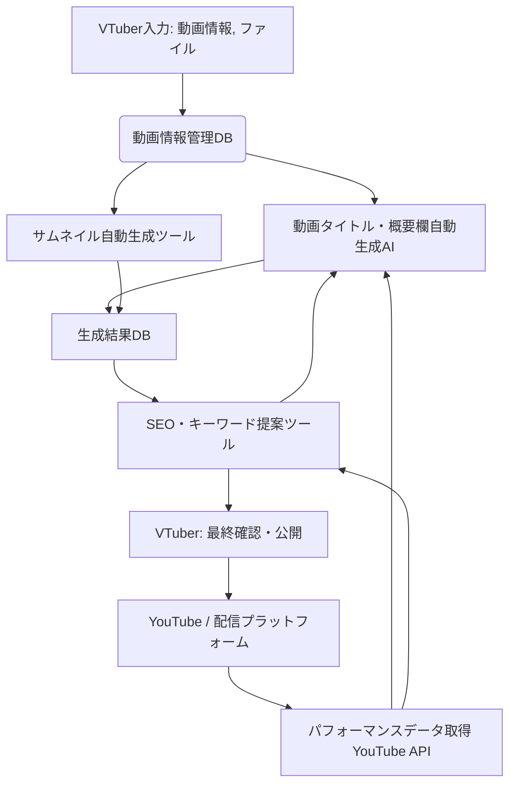

# 動画公開最適化スイート 設計書

## 連鎖ツール名
動画公開最適化スイート

## 目的
VTuberが動画を公開する際のタイトル、概要欄、サムネイル、キーワード選定といった一連のプロセスを、AIと連携ツールによって自動化・最適化し、動画の発見性、クリック率、視聴回数を最大化する。これにより、VTuberの作業負担を軽減し、コンテンツ制作への集中を促す。

## 連携概要
本スイートは、以下の3つの主要ツールが連携し、動画公開プロセスを効率化・最適化する。
1.  **動画タイトル・概要欄自動生成AI:** 動画の内容からテキスト情報を生成。
2.  **サムネイル自動生成ツール:** 動画の内容からビジュアル情報を生成。
3.  **SEO・キーワード提案ツール:** 生成されたテキスト情報からSEOに強いキーワードを提案。

これらのツールは、動画の企画段階で入力された情報や、動画ファイル自体から抽出されたメタデータを共有し、一貫した最適化を実現する。

## データフロー
1.  **動画情報入力:** VTuberが動画のテーマ、ジャンル、主要キーワード、動画ファイルなどをシステムに入力。
2.  **動画タイトル・概要欄自動生成AI:** 入力された動画情報に基づき、複数のタイトル案と概要欄を生成し、システムに保存。
3.  **サムネイル自動生成ツール:** 動画ファイルからキーフレームを抽出し、生成されたタイトルや概要欄のキーワードを参考に、目を引くサムネイル画像を生成し、システムに保存。
4.  **SEO・キーワード提案ツール:** 生成されたタイトル、概要欄、動画のメタデータから関連キーワードを抽出し、検索ボリュームや競合度を分析して最適なキーワードリストを提案。この情報はタイトル・概要欄生成AIにもフィードバックされ、次回の生成精度向上に利用される。
5.  **最終確認・公開:** VTuberは生成されたタイトル、概要欄、サムネイル、キーワード提案を確認し、必要に応じて修正後、YouTubeなどのプラットフォームに公開。
6.  **パフォーマンスフィードバック:** 公開後の動画パフォーマンスデータ（視聴回数、クリック率、検索流入キーワードなど）をYouTube API経由で取得し、各ツール（特にAI）の学習データとして利用し、継続的な精度向上を図る。

## 技術的連携方法
*   **API連携:** 各ツールはRESTful APIを通じて相互に連携し、データの送受信を行う。
*   **共通データストア:** 動画情報、生成されたタイトル・概要欄、サムネイル画像、キーワード提案などは、共通のデータベースまたはストレージに保存され、各ツールからアクセス可能とする。
*   **メッセージキュー:** リアルタイム性が求められる処理や、非同期処理が必要な場合は、メッセージキュー（例：Kafka, RabbitMQ）を利用してツール間の連携を行う。
*   **認証・認可:** 各ツール間のAPI呼び出しには、OAuth2.0などのセキュアな認証・認可メカニズムを導入。

## システム全体像

## 開発ロードマップ（連鎖視点）
*   **フェーズ1 (MVP):** 各ツールの基本的な機能（タイトル・概要欄生成、サムネイル生成、キーワード提案）を独立して動作させ、手動でのデータ連携を可能にする。共通データストアの構築。
*   **フェーズ2:** 各ツール間のAPI連携を実装し、自動化されたデータフローを確立。パフォーマンスフィードバックループの構築。
*   **フェーズ3:** AIモデルの精度向上、より高度なSEO最適化、他配信プラットフォームへの対応、ユーザーインターフェースの統合。
